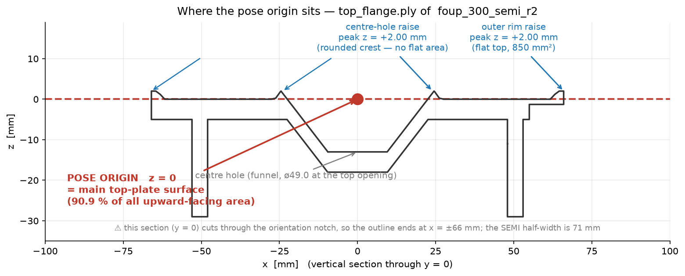
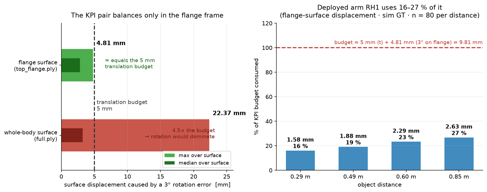
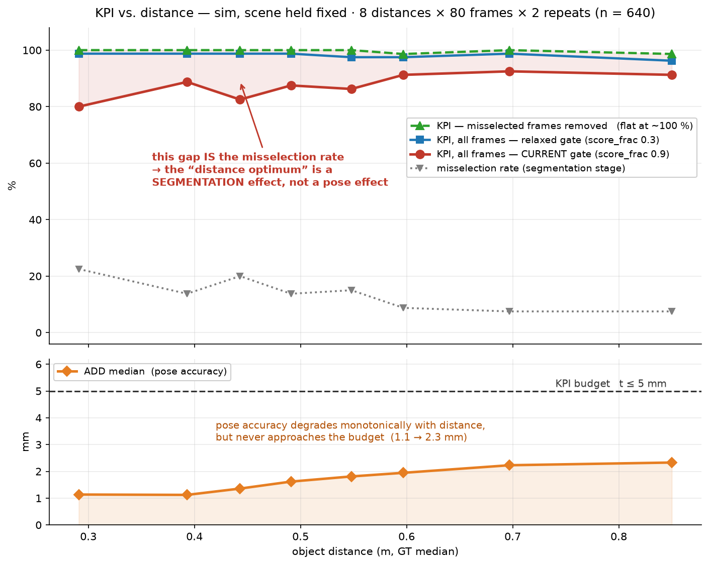
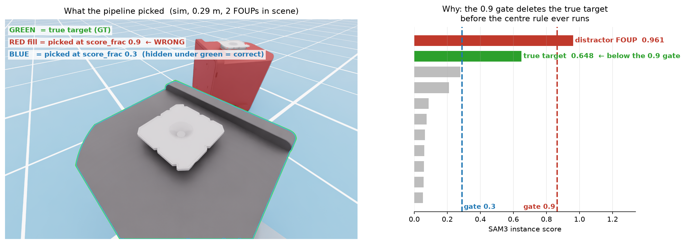

# FOUP 6D Pose 파이프라인 — 설계 근거와 검증 결과 (배포 후보 `RH1` 기준)

> **문서 성격**: 사내 공유용. 「무엇을 만들었나 → 왜 그렇게 설계했나(논문·코드 근거) → sim 검증 → 실물 검증 → 한계」 순서.
> **정본**: 측정치는 `RESULTS.md`, 선정 근거는 `RH_RATIONALE.md`, 코드 지도는 `IMPLEMENTATION_MAP.md`.
> 이 문서는 그것들의 **요약이고 수치를 새로 만들지 않는다.** 최종 갱신 **2026-09-02**.
>
> 🔴 **읽기 전 한 줄**: 정확도 수치는 **전부 sim GT 대비**다. **실물에는 GT 가 없어서 절대 정확도를 잰 적이 없다.**
> 실물에서 확인된 것은 «동작한다 · 대실패가 없다 · 눈으로 맞다» 까지다.

---

## 1. 과제와 합격 기준

300mm FOUP 의 **6D pose**(위치 3 + 자세 3)를 CAD 와 스테레오 영상만으로 추정한다.

### 1.1 출력이 정확히 무엇인가 — `cam_T_obj`

| | 정의 |
|---|---|
| **도착점 (물체)** | **top flange 의 «주 상판» 윗면 중심**, 중심축 위 |
| **출발점 (카메라)** | 🔴 **좌측 정류(rectified) 카메라의 광학 중심** — 하우징 중심도, 베이스라인 중점도 아니다 |
| 축 | OpenCV 관례 — **+X 오른쪽 · +Y 아래 · +Z 전방** |
| 값 | `R` 3×3 row-major + `t` **mm** (BOP 관례) |

🔴 **«주 상면» 은 융기가 아니라 «주 상판(중간 바디)의 윗면» 이다.** 메쉬 실측:
위를 향하는 면적의 **90.9% 가 z = 0**(주 상판)이고, **최외곽 융기와 중심홀 융기는 z = +2.00mm** 로 **그보다 위**다.



> **그림 0.** `top_flange.ply` 수직 단면. 빨강 점이 pose 원점(z=0, 주 상판 윗면)이고 융기 둘은 +2mm 위에 있다.
> 중심홀 융기는 **둥근 능선이라 평평한 면이 없고**, 최외곽 융기만 평평한 꼭대기(850mm²)를 갖는다.

⚠️ **줄자로 «카메라 → FOUP» 거리를 잴 때 좌측 렌즈의 광학 중심에서 재야 한다.** 실물에서 `t_z` 가
줄자보다 **+10~14mm** 큰 계통 편향이 미해결인데(§5.3 관련), **이 기준점 규약이 후보 중 하나**다.

### 1.2 합격 기준

로봇이 flange 를 파지해야 하므로 기준은 그 좌표계에서 정의된다.

| 지표 | 기준 |
|---|---|
| Translation error | **≤ 5 mm** |
| Rotation error | **≤ 3°** |

🔴 **이 두 숫자는 좌표계에 딸린 값이다.** 회전 3° 가 물리적으로 얼마인지는 원점에서의 거리에 비례한다
(`d = 2·r·sin(θ/2)`):

| 3° 일 때 표면 최대 변위 | 값 |
|---|---|
| **flange 표면** (r ≤ 91.8mm) | **4.81 mm** ≈ t 예산 5mm |
| 몸체 전체 표면 (r ≤ 427.3mm) | **22.37 mm** = t 예산의 4.5배 |

→ **두 항이 균형을 이루는 것은 flange 좌표계에서만**이다. KPI 와 원점 규약은 분리해서 인용할 수 없다.



> **그림 3.** (왼쪽) 회전 3° 가 표면을 얼마나 움직이나 — flange 에서 **4.81mm** 로 평행이동 예산 5mm 와
> 균형이 맞지만, 몸체 전체에서는 **22.37mm** 로 회전이 지배한다.
> (오른쪽) 배포 후보 `RH1` 의 실제 소진 — **예산의 16~27%**(sim GT, 거리당 n=80). 여유가 크다.

⚠️ 합격 기준 자체는 **과제 요건으로 주어진 값**이고 본 연구가 유도한 것이 아니다. 유도하려면
«파지 기구의 포획 반경» 한 값이 더 필요하다(→ `RH_RATIONALE.md §8`).

---

## 2. 기존 조합 vs 우리 파이프라인

### 2.1 단순 연결이면 이렇게 된다

```
FoundationStereo → SAM3 → FoundationPose
```

세 기반모델을 그대로 이으면 **동작은 한다.** 다만 그대로 두면 다음이 열려 있다.

| 열린 문제 | 그대로 두면 |
|---|---|
| 스테레오 상업화 | GitHub 코드가 **research-only** — 그대로 쓰면 상업 경로가 막힌다 |
| 같은 물체가 여럿 | *"어느 FOUP 이 타깃인가"* 를 **모델이 못 푼다** |
| 평행이동 정밀도 | `full` 메쉬 기준 **네트워크 1px = 4.34mm** — 구조적 천장 |
| 회전 vs 평행이동 | 한 단계에서 **둘 다 최적일 수 없다** (아래 3.4) |

### 2.2 우리가 더한 것 — 네 가지

```
① stereo(NGC ONNX, 전·후처리 재구현)  ─ 상업 경로
② SAM3 텍스트 + 인스턴스 선택 규칙     ─ "어느 것이 타깃인가"
③ pose_fp 2단계 (메쉬 교체 full→flange) ─ 평행이동 해상도 3.16배
④ 하이브리드 (R=stage1 · t=stage2)     ─ 회전·평행이동을 각각 최적 단계에서
```

🟢 **네 기반모델 저장소 모두 소스 수정 0줄**이다(`git status` 로 확인, → `RH_RATIONALE.md §9`).
우리 코드는 **스테이지 3 + 병합 1 + 공유 규약 1** 이 전부다.

| 파일 | 줄 수 | 역할 |
|---|--:|---|
| `stages/stereo_onnx.py` | — | ONNX 세션 + **전·후처리 직접 구현** (repo 코드 미사용) |
| `stages/segment_sam3.py` | — | 텍스트 질의 + **인스턴스 선택** |
| `stages/pose_fp.py` | ~470 | **2단계 조립** (메쉬 교체·씨앗 주입·입력 처리) |
| `eval/hybrid_pose.py` | **85** | **R·t 접합** (추론 0, 파일 병합) |
| `contracts.py` | 245 | 스테이지 경계의 **유일한 공유 코드** (스키마 + 선택 규칙) |

★ **가장 큰 효과를 내는 부품이 가장 작다** — `hybrid_pose.py` 는 85줄이고 GPU 를 안 쓴다.

### 2.3 `RH1` 전체 흐름 — 단계별로 무엇이 들어가고 무엇이 나오나

입력은 **세 파일뿐**이다: `left.png` · `right.png` · `cam.json`(rectified · PNG 무손실 · BGR8).
스테이지는 **서로 다른 가상환경의 독립 프로세스**이고 **디스크로만** 통신한다.

| # | 단계 | 입력 | 하는 일 | 출력 |
|:-:|---|---|---|---|
| **1** | `stereo_onnx` | `left/right.png`, `cam.json` | ONNX 세션으로 disparity 추론 (+ 전·후처리, §3.1) | `disparity.npy` · `depth.png`(16-bit mm) · `valid.png` |
| **2** | `segment_sam3` | `left.png` + **텍스트 프롬프트** | SAM3 가 개념에 맞는 **인스턴스 여러 개**를 냄 → **선택 규칙**으로 하나 고름 | `mask_full.png` · `det_full.json` |
| **3a** | `pose_fp` **stage1** | `left.png` + `depth.png` + `mask_full.png` + **`full.ply`** | `est1.register(...)` — 마스크로 초기 위치 추정 후 render-and-compare | **`pose_coarse.json`** |
| **3b** | `pose_fp` **stage2** | 3a 의 pose + **`top_flange.ply`** | ① flange 마스크를 **메쉬 투영**으로 생성 ② 그 밖 depth 를 0 으로 ③ 씨앗 주입 후 `est2.track_one(...)` | **`pose_refined.json`** · `mask_flange_proj.png` |
| **4** | `hybrid_pose` | 3a·3b 의 JSON 두 개 | **`R` 은 3a 에서, `t` 는 3b 에서** 가져와 합침 (추론 0) | ★ **`pose_coarse.json`** (= `RH1` 최종) |

**단계별로 중요한 점**

- **1 → 2 는 서로 독립**이다. 분할은 `left.png` 만 보고, depth 는 pose 단계에서 처음 만난다.
  → 분할이 틀려도 depth 는 멀쩡하고, 그 반대도 성립한다. 진단 시 두 축을 따로 봐야 하는 이유다.
- **2 의 어려움은 «분할» 이 아니라 «선택» 이다.** SAM3 는 개념에 맞는 것을 **전부** 내주므로
  FOUP 이 여러 대면 *"어느 것이 타깃인가"* 는 모델이 답할 수 없다(§3.7).
- **3a 에서 마스크는 «초기값 계산에만»** 쓰인다. 네트워크에 들어가는 `rgb`/`depth` 는 마스킹되지 않는다
  (upstream 그대로). 그래서 마스크 품질이 조금 나빠도 pose 는 잘 버틴다.
- **3b 가 이 파이프라인의 핵심 설계**다. 메쉬가 `full` → `top_flange` 로 **바뀌면서**
  유효 해상도가 3.16배 올라간다(§3.3). 🔴 그 마스크를 **분할이 아니라 CAD 투영으로** 만들기 때문에
  **SAM3 의 flange 검출에 의존하지 않는다**(§3.6).
- **4 는 파일 병합이다.** GPU 를 안 쓰고 85줄인데, 3a(회전이 좋음)와 3b(평행이동이 좋음)의
  **장점만 취한다**(§3.5). 출력 파일 이름이 `pose_coarse.json` 인 것은 하류 도구가 그 이름을 찾기 때문이다.

**비용** (1920×1200, RTX 5090): 콜드 스타트 ~40초(ONNX 세션 31.5s + FP 7.1s) + 프레임당 **약 2.5초**.
🔴 **운용상 진짜 위험은 추론이 아니라 콜드 스타트**다 — 요청마다 프로세스를 띄우면 매번 40초다.
배포 시 **venv 별 상주 서버 + IPC** 가 선결 과제다.

---

## 3. 설계 근거 — 논문과 코드

> 인용은 전부 **원문 확인**(2026-09-02). 줄 번호 17개를 그날 코드에 재대조했다.
> 논문 = Wen, Yang, Kautz, Birchfield, **FoundationPose**, CVPR 2024 (arXiv:2312.08344).
> ⚠️ **«논문 §3.3» 은 그 논문의 절 번호**이고 **«3.3» 은 이 문서의 절 번호**다 — 숫자가 겹치니 주의.
>
> **근거의 성격을 세 단계로 표시한다**: 🟢 **논문 + 코드** / 🟡 **코드만**(논문에 없음) / 🔴 **우리 측정뿐**.

| 절 | 구성요소 | 근거 |
|---|---|---|
| 3.1 | 스테레오 전·후처리 | 🟢 **논문 §3.1 + upstream 코드**(정규화 상수·패딩 32) · 🔴 배율·범위 게이트는 우리 측정 |
| 3.2 | 프롬프트 `f002` | 🟢 **SAM3 논문 §1·§2·§3** + 3표본 실험 |
| 3.3 | crop = 물체 지름 → 유효 해상도 | 🟢 **논문 §3.3 + supplementary p14**(160×160) + `Utils.py:605`. 🔴 `crop_ratio` 값 1.2/1.1 은 설정 파일에만 |
| 3.4 | 갱신 보폭 비대칭 | 🟡 **절반** — 회전 상수 20°는 **논문 p14**, 평행이동의 지름 정규화는 **코드만** |
| 3.5 | R·t 접합 가능 (하이브리드) | 🟢 **논문 §5.3** + `Utils.py:850` |
| 3.6 | stage2 입력 depth 처리 | 🟡 depth denoising **존재는 논문 p13**, `radius=2` 픽셀 단위는 코드만 + 우리 측정 |
| 3.7 | 인스턴스 선택 규칙 | 🟡 **과제 정의상 모델 밖**(논문 §2) + 🔴 규칙 자체는 우리 것 |

### 3.1 스테레오 — **전·후처리를 직접 구현했다** (라이선스 + 정확도)

🔴 **왜 재구현했나**: GitHub `FoundationStereo` 는 **research-only** 이고, 상업 사용이 열려 있는 것은
**NGC/TAO 의 ONNX 가중치**뿐이다. **가중치가 상업 가능해도 저장소 코드는 아니므로**
`stereo_onnx.py` 는 `third_party/FoundationStereo` 를 **한 줄도 import 하지 않는다.**
⚠️ 이 파일에 그 repo 를 import 하면 **상업 경로가 그 순간 깨진다.**

**전처리** (`stereo_onnx.py`)

| # | 처리 | 왜 |
|:-:|---|---|
| 1 | **축소** `--scale 0.5` (`INTER_AREA`) | 🔴 **우리 측정** — 1920×1200 원본은 ONNX Runtime 에서 **실행 불가**(Softmax 단일 버퍼 OOM). 상한은 0.5625 |
| 2 | **replicate 패딩 (32 배수)** | 🟢 **논문 §3.1** — 특징 피라미드가 `i ∈ {4,8,16,32}` 라 **가장 깊은 단계가 1/32** · 🟢 upstream `run_demo.py:82` 도 `divis_by=32` |
| 3 | **ImageNet 정규화** `(x/255 − mean)/std` | 🟢 **upstream `core/foundation_stereo.py:43-48·204-205`** 이 `Normalize([0.485,0.456,0.406],[0.229,0.224,0.225])(img/255)` 를 쓴다(논문 §3.1 의 단안 prior 가 DepthAnythingV2 = DINOv2 계보). ONNX 그래프에는 이 레이어가 **없어서** 우리가 넣는다. 🔴 우리 측정: raw 0–255 면 **MAE 1.43px** 어긋난다 |
| 4 | NCHW float32 배치화 | ONNX 입력 규약 (`left_image`/`right_image`) |

⚠️ **패딩 «방향» 은 등가다 (2026-09-02 정정)** — 초판에 *"왼쪽에 패딩하면 disparity 가 오프셋된다"* 고
적었는데 **틀렸다.** 좌·우 영상에 **같은** 패딩을 주면 `x_L − x_R` 이 보존된다. 실측: 가로 10px 를
왼쪽에 줘도 disparity 차이가 **중앙 0.038px**(모델 잡음 수준)이고, **upstream 은 오히려 좌우 대칭**
패딩이다(`InputPadder(mode='sintel')`). 우리가 오른쪽·아래를 쓰는 이유는 **되돌리기가 단순 슬라이스**여서다.
🔴 피해야 할 것은 **«좌·우에 서로 다른 패딩을 주는 것»** 뿐이다.

**후처리**

| # | 처리 | 왜 |
|:-:|---|---|
| 5 | 패딩 제거 `disp[:hs,:ws]` | 유효 영역만 남긴다 |
| 6 | **배율 복원** — 크기 되돌리고 **값도 `/scale`** | disparity 는 **길이량**이라 축소하면 값도 같은 비율로 작아진다. 크기만 되돌리면 **깊이가 2배 틀린다** |
| 7 | **`depth = fx · baseline / disparity`** | rectified 스테레오 기본식. `cam.json` 의 실측 `fx`·`baseline` 사용 |
| 8 | `disparity < 0.05 px` → **NaN** | 0 근처에서 depth 가 발산한다 |
| 9 | 범위 게이트 `100 mm ≤ z ≤ 10,000 mm` → `valid.png` | 명백한 이상치 제거. ⚠️ **범위 검사일 뿐이라 «맞다» 를 뜻하지 않는다** |
| 10 | **16-bit PNG, `np.rint`, 0 = invalid** | 🔴 `astype(uint16)` 는 **버림**이라 depth 가 평균 **0.5mm 작아진다**(실제로 겪은 버그) |

⚠️ **ONNX 세션 초기화가 ~31초**(53k 노드)다. **반드시 재사용**해야 한다 — 프레임마다 프로세스를 띄우면
84프레임에 43분이 초기화로만 날아간다.
★ 산출물은 `contracts.write_stereo_frame()` 을 통해서만 쓴다 — 백엔드(ONNX / PyTorch)가 달라도
**스키마가 하나**여야 비교가 가능하기 때문이다.

### 3.2 프롬프트 `f002` — **설계에서 유도하고 실험으로 확인했다**

채택: **`cube shaped sealed plastic wafer pod`**

**(가) SAM3 는 «짧은 명사구(NP)» 를 받도록 설계됐다** — 🟢 **논문 원문**

> Ravi et al., **SAM 3: Segment Anything with Concepts**, arXiv:2511.16719v2 (`docs/papers/`)

| 위치 | 원문 |
|---|---|
| **§2 과제 정의** (p3) | *"…**detect, segment and track all instances** of a visual concept specified by a short text phrase, image exemplars… **We restrict concepts to those defined by simple noun phrases (NPs) consisting of a noun and optional modifiers.**"* |
| **§1 서론** (p2) | *"To focus on recognizing **atomic visual concepts, we constrain text to simple noun phrases (NPs)** … While **SAM 3 is not designed for long referring expressions or queries requiring reasoning**…"* |
| **§3 Presence Token** (p4) | *"…**p(NP is present in input)** … Each proposal query qᵢ only needs to solve **p(qᵢ is a match | NP is present in input)**. **The final score … is the product of its own score and the presence score.**"* |
| **§2** (p3) | *"Our vocabulary includes any simple noun phrase groundable in a visual scene, **which makes the task intrinsically ambiguous** … subjective descriptors ('cozy', 'large')…"* |

★ **«NP = 명사 + 선택적 수식어» 가 논문의 정의**다 — 아래 (나)의 규칙들이 그 정의의 따름정리다.
(보조: 저장소 `README:49·351`, `agent_core.py:238` 실패 시 *"simple noun phrase"* 로 재시도.)

**(나) 우리 경험 규칙이 그 설계의 따름정리다**

| 측정된 규칙 | 설계로부터의 설명 |
|---|---|
| **약어 단독은 죽는다** — `FOUP` **0/9** ↔ `front opening unified pod` **9/9** | SA-Co 는 **NP 표층형**으로 라벨링됐다. 약어는 그 분포에 거의 없다 |
| **형상어는 «수식어 자리» 에서만 접지된다** — `cube shaped case` 9/9 ↔ **`plastic cube` 0/9** | NP = `[modifier*] + HEAD`. `plastic cube` 는 **head 가 `cube`**(우리 물체가 아니다) |
| **핵명사를 빼면 검출 자체가 깨진다** (9/9 → 7/9) | **head 가 개념을 정하고 modifier 는 좁힐 뿐**이다 |
| **슬롯별 최적을 조합하면 최적이 안 나온다** | phrase 를 **통째로 임베딩**한다 — 단어별 기여의 합이 아니다 |
| **색어는 조건부다** — 맞는 색에서만 걸리고 아니면 **조용히 검출 0** | 🔴 버그가 아니라 **presence token 의 설계된 동작**이다 |
| **영어 전용** — 한/일/독 전부 0/9 | SA-Co 가 **영어 NP** 데이터셋이다 |
| **제조사명은 해롭다** — 그 제조사 사진에만 붙는다 | 270K 개념이라도 **상표는 특정 외관과 결합**한 spurious correlation |

**(다) 그래서 `f002` 는 설계 요건의 교집합이다**

| 요건 | 충족 |
|---|---|
| 짧은 명사구(문장 아님) | 6단어 NP ✅ |
| 도메인 head noun | `pod` · `wafer` ✅ |
| 형상 접지가 **수식어 자리** | `cube shaped` ✅ |
| 재질·상태 수식어 | `sealed` · `plastic` ✅ |
| **약어 · 색어 · 마침표 · 제조사명 없음** | ✅ |

**(라) 실험으로 좁혔다 — 표본을 넓혀 가며 세 벌**

| 표본 | 규모 | 결과 |
|---|---|---|
| 웹 사진 | **237장** × 136개 프롬프트 (사용자가 79장 직접 판정) | 서열화 |
| 실물 사진 | 3라운드(28·40·50cm) × 40장 | **136 → 81 → 70 → 58** (신규 0 = 중첩으로 좁혀짐) |
| 최종 | — | **58 → 12 → 4**, 그중 `f002` 가 **웹·실물 양쪽 1위** |

🔴 **주의 셋** — ① **`score` 로 순위를 매기면 안 된다**(마스크 품질과 상관 r=+0.06). `score` 는
**문턱 지표**라 «미검출까지의 여유(최소값)» 로 읽는다. ② **웹 서열은 «순서» 는 맞히고 «간격» 은
과소평가한다** — 웹에서 «구분 안 됨» 이던 것들이 실물에서 크게 갈렸다. ③ **프롬프트를 바꿔도
pose 는 거의 안 바뀐다** — 갈리는 축은 **«검출되느냐» 하나**이고, 그게 곧 KPI 다.

### 3.3 왜 «메쉬를 갈아타면» 평행이동이 좋아지나 — **논문 §3.3 + 코드**

> 논문 §3.3: *"We then project the object origin to the image space to determine the crop center.
> We then project the **slightly enlarged object diameter (the maximum distance between any pair of
> points on the object surface)** to determine the crop size…"*

코드가 그 문장 그대로다 — `Utils.py:605`:
```python
radius = mesh_diameter * crop_ratio / 2      # crop 을 3D 에서 정의한다
```
그 창을 `input_resize`(=**160**)로 줄인다(`Utils.py:597`). 🟢 **이 값도 논문에 있다** — supplementary p14:
*"cropped based on the perturbed pose and **resized into 160 × 160** before sending to the network."* 따라서

```
네트워크 1px = mesh_diameter × crop_ratio / 160  [mm]     ← 거리에도 fx 에도 무관
```

| 메쉬 | `mesh_diameter` | refiner 1px |
|---|--:|--:|
| `full.ply` | 579.0 mm | **4.34 mm** |
| `top_flange.ply` | 183.5 mm | **1.38 mm** |

→ ★ **stage2 에서 유효 해상도가 3.16배 좋아진다.** 거리를 당겨서가 아니라 **메쉬가 작아서**다.
🔴 그래서 `--primary full` 만 쓰면 t 에 **구조적 천장**이 있고, 그 천장은 **거리로 못 낮춘다.**

### 3.4 왜 회전과 평행이동이 서로 다른 단계에서 좋은가 — **코드**

`predict_pose_refine.py` (배포 가중치 `trans_rep: tracknet` · `normalize_xyz: true` · `rot_rep: axis_angle`):

```python
199:  trans_delta   = output["trans"]                                   # 무차원
221:  rot_mat_delta = torch.tanh(output["rot"]) * rot_normalizer        # ← 상수 20°
229:  trans_delta  *= (mesh_diameter / 2)                               # ← 메쉬 크기에 비례
```

| | 곱해지는 것 | 메쉬 크기 의존 |
|---|---|---|
| 평행이동 | **`mesh_diameter/2`** (579→183.5mm 이면 3.16배 세밀) | ✅ |
| 회전 | `rot_normalizer` = **20° 상수** | ❌ |

🟢 **`rot_normalizer = 20°` 는 논문에 근거가 있다** (2026-09-02 확인) — supplementary p14:
> *"the pose is randomly perturbed by adding **translation noise under the magnitude of 0.02m, 0.02m,
> 0.05m** for XYZ axis respectively and **rotation under the magnitude of 20°**"*

★ **네트워크의 회전 출력 범위(±20°)가 학습 교란 크기와 정확히 일치한다** — `tanh(out) × 0.3490658 rad = ±20.0°`.
🔴 **반면 평행이동 쪽은 논문이 «절대 미터»(0.02/0.02/0.05 m)로 적고 `mesh_diameter` 정규화를 언급하지 않는다.**
출시된 설정은 `normalize_xyz: true` 로 **지름에 비례**시킨다 → **그 정규화는 여전히 코드 근거뿐**이다.

동시에 `top_flange` 는 근사 4회 대칭이고 **방향 정보가 표면의 3.5%·전부 경계**에 있다.
→ ★★ **stage2 는 «회전 증거» 를 «평행이동 해상도» 와 맞바꾼다.**
🔴 **평행이동의 «지름 정규화» 만 논문에 없다** — 그 부분만 *"공개 구현의 학습 설정에서"* 라고 쓴다.

### 3.5 왜 R 과 t 를 갈라 써도 되나 (= 하이브리드) — **논문 §5.3 + 코드**

> 논문 §5.3 (supplementary): *"this **disentangled representation removes the dependency on the
> updated orientation when applying the translation update**."*

`Utils.py:850-856`:
```python
B_in_cam[:,:3,3]  = A_in_cam[:,:3,3] + trans_delta       # t ← t + Δt   (R 이 안 낀다)
B_in_cam[:,:3,:3] = rot_mat_delta @ A_in_cam[:,:3,:3]    # R ← ΔR · R   (t 가 안 낀다)
```
→ ★ **한 단계의 `R` 과 다른 단계의 `t` 를 접합해도 각각이 그 단계에서 최적화된 값 그대로 유지된다.**
🔴 물체 좌표계 갱신(`t ← R·Δt + t`)이었다면 접합이 의미를 잃는다 — **이 파라미터화가 전제 조건**이다.

### 3.6 stage2 의 입력 처리 — flange 밖 depth 를 «측정값 없음» 으로

1. refiner 는 **A(메쉬 렌더) ↔ B(관측)** 를 비교한다.
2. stage2 는 메쉬를 `top_flange.ply` 로 바꾸므로 **A 가 만들 수 없는 기하가 B 에 남는다.**
3. 그 양이 크다 — stage2 crop(220mm) 안 물체 픽셀 중 **flange 가 아닌 것이 60.6 / 62.9 / 63.8%**
   (0.29 / 0.49 / 0.85m). **거리 무관**(crop 이 3D 정의).
4. 🔴 **upstream 자체 경계는 이 상황에서 아무것도 못 거른다** — `|xyz−t| ≥ 2×mesh_radius`(±183.5mm)인데
   crop 자체가 220mm 라 **통과율 100%**.
5. `track_one(rgb, depth, K, iteration)` 에 **마스크 인자가 없다** → depth 가 유일한 통로.
6. 그리고 depth 0 은 **upstream 자신의 «측정값 없음» 표기**다(`depth < 0.001` → xyz 0).

★ 마스크는 **분할이 아니라 `top_flange.ply` 를 coarse pose 로 투영**해 만든다.
→ **`RH1` 은 SAM3 의 flange 검출에 전혀 의존하지 않는다.** (실물 flange 프롬프트는 20개 중 **2개**만
살아남았으므로 이 설계가 그 취약축을 아예 안 밟는다.)

### 3.7 🔴 정직하게 — **근거가 upstream 에 없는 구성요소가 하나 있다**

**`--select center` + `score_frac 0.9`**(다중 인스턴스에서 타깃 고르기)는 **우리 휴리스틱**이다.

🟢 **다만 «근거 없는 자유 파라미터» 가 아니라 «과제 정의상 모델 밖의 문제» 다** — 논문 §2 (p3)가
PCS 를 ***"detect, segment and track **all instances** of a visual concept"*** 로 정의한다.
즉 **«여럿 중 어느 것인가» 는 PCS 의 출력이 아니다.** 그리고 §3 (p4)의 점수 분해식
`final = p(qᵢ 가 매치 | NP 존재) × p(NP 존재)` 에서 앞 항은 ***"이 개체가 그 개념의 인스턴스인가"*** 에
답하므로 **동종 물체를 점수로 구분할 수 없는 것은 성능 한계가 아니라 정의**다.

🔴 **논문이 제시하는 해법은 «단일 객체 경로(PVS)» 다** — §1 (p1): PVS 는 *"points, boxes or masks to
**segment a single object per prompt**"*. ⚠️ **PCS 의 exemplar 박스는 해법이 아니다** —
*"given a positive bounding box on a dog, the model will detect **all** dogs"*(p4).
→ 어느 쪽이든 **«대략적 위치» 라는 외부 정보가 필요**하고, 현 환경엔 로봇이 없어 그 정보가 없다.

측정 결과는 다음과 같다:

- ✅ **검증 조건(단일 대상 장면)에서는 결과를 바꾸지 않는다** — 세 규칙이 **304 사례에서 동일한 마스크**.
- ✅ 그 이유가 **기전 수준으로 측정됐다**: 점수 게이트를 통과하는 후보가 **60/60 프레임에서 1개**라
  뒤 단계가 관여하지 않는다(차순위 점수가 최고점의 **최대 0.33배**).
- 🔴 **동종 방해물이 있는 장면에서만** 문제가 된다 → §5.5 참조.

---

## 4. sim 검증 결과

> **ADD** = *Average Distance of Model Points* (Hinterstoisser et al., ACCV 2012) —
> `mean over CAD vertices of ‖(R_pred·v + t_pred) − (R_gt·v + t_gt)‖`, 단위 **mm**.
> `R`(도)과 `t`(mm)은 단위가 달라 더할 수 없으므로 **회전 오차를 물체 형상에 실어 mm 로 환산**한 값이다.
> ⚠️ 아래 §4 의 ADD 는 **`full.ply`** 기준, §1 의 «flange 표면 변위» 는 **`top_flange.ply`** 기준 —
> **나란히 놓지 말 것.**

### 4.1 하이브리드가 어느 단일 단계보다 낫다 — **설계의 핵심 주장**

3.4 가 예측하는 «coarse 는 R 이 좋고 t 가 나쁘다 / refined 는 반대» 가 **세 파이프라인에서 동시에** 관측된다:

| 출처 | coarse R / t | refined R / t |
|---|---|---|
| 원거리 `full` (n=120) | **0.549°** / 1.713mm | 0.737° / **1.280mm** |
| 근접 `flange` (n=120) | **0.510°** / **0.928mm** | 0.656° / 1.104mm |
| 실물 검증 체인 3종 (n=10) | **0.37~0.50°** / 2.0~2.3mm | 1.36~1.42° / **1.04~1.26mm** |

**부호가 한 번도 뒤집히지 않는다.**
→ 하이브리드 **ADD 중앙 1.395mm** — 어느 단일 단계보다 **1.5~2배** 좋고,
`refined` 단독은 KPI **9/10** 인데 하이브리드는 **10/10**.

### 4.2 ★★ 반증 가능한 예측을 세우고 시험했다

> 3.4 가 옳다면 — **`--primary flange` 로 돌리면 stage1·stage2 가 «같은 메쉬」라 이득이 사라져야 한다.**

측정: `--primary flange` 에서 stage2 의 t 이득이 **1.100 → 1.042mm (0.058mm)** 인데
**FP 재실행 잡음 바닥이 0.512mm** 다 → **측정되지 않는다.** ✅ **예측대로 사라졌다.**

★ 이것이 *"단계를 하나 더 두면 좋다"* 가 아니라 ***"그 단계가 메쉬를 갈아타기 때문에 좋다"*** 를 구분한 증거다.

### 4.3 거리 사다리 — **씬 고정 8거리 × 80프레임 × 2반복 (640프레임)**

| 거리(m) | 0.291 | 0.393 | 0.443 | 0.491 | 0.548 | 0.597 | 0.697 | 0.850 |
|---|---|---|---|---|---|---|---|---|
| **KPI(전체)** | 80.0% | 88.8% | 82.5% | 87.5% | 86.2% | 91.2% | 92.5% | 91.2% |
| **KPI(오선택 제외)** | **62/62** | **69/69** | **64/64** | **69/69** | **68/68** | 72/73 | **74/74** | 73/74 |
| ADD 중앙 | 1.135 | 1.122 | 1.358 | 1.618 | 1.811 | 1.946 | 2.229 | 2.330 |



> **그림 1.** 씬을 고정한 8거리 사다리. **초록(오선택 제외 KPI)이 전 거리 ~100% 로 평평**하고,
> 빨강(현행)과의 **간격이 곧 오선택률**이다. 파랑은 선택 게이트만 0.3 으로 바꾼 것 — 같은 pose 단계인데
> 곡선이 평평해진다. 아래 칸은 pose 정확도(ADD)로, 거리와 함께 단조 악화하지만 **예산 근처에도 안 간다.**

🔴🔴 **핵심 발견: «거리 최적점» 은 pose 가 아니라 «분할» 의 성질이었다.**
오선택을 빼면 KPI 가 **전 거리 ~100%**(0.291m 포함)이고, 종단 곡선은 **오선택 곡선의 거울상**일 뿐이었다.
→ **처방이 «거리를 옮겨라» 가 아니라 «선택 규칙을 고쳐라» 로 바뀐다.**

실제로 선택 규칙 하나만 바꾸면(`score_frac` 0.9 → 0.3):

| | 오선택 | KPI |
|---|---|---|
| 현행 0.9 | 87/640 | **560/640 (87.5%)** |
| 0.3 | **9/640** | **628/640 (98.1%)** |

**8/8 거리에서 개선**(McNemar p=3.9e-18)이고 **ADD·R·t 는 소수점까지 그대로**다 —
바뀐 것은 오로지 «어느 것을 골랐나» 다.



> **그림 2.** 오선택의 기전. (왼쪽) 근접·잘림 프레임에서 **타깃은 위에서 내려다본 잘린 모습**이라
> «정육면체» 로 안 보이고, 배경의 방해물 FOUP 이 온전한 큐브로 보인다.
> (오른쪽) SAM3 후보 점수 — **방해물 0.961 vs 진짜 타깃 0.648** 이라 `0.9 × 최고점 = 0.865` 게이트가
> **정답을 먼저 지운다.** 「중앙 근접」 규칙은 실행조차 되지 않는다(오선택 40프레임 **전부**에서
> 타깃이 더 중앙에 있었다). 🔴 **프롬프트가 «옳을수록» 방해물이 이긴다 — 문장을 바꿔 고칠 문제가 아니다.**
⚠️ **기본값은 0.9 로 유지 중**이다(현행 파이프라인으로 보고서 작성 방침). 단일 물체 장면에서는 무효과다.

### 4.4 노브들은 **구분되지 않는다** — 「튜닝으로 얻을 것이 없다」

| 노브 | 결과 |
|---|---|
| `--refine-iter` 2 / 5 / 10 | 🔴 **구분 안 됨** (차이가 재실행 잡음 바닥 아래) |
| `--est-iter` 5 | 🟢 **저자 기본값 그대로** |
| `--stereo-scale` 0.5 ↔ 0.5625 | t **0.147mm** 이득에 **비용 +36%** (상한 0.5625, 그 위는 실행 불가) |
| `--input-scale` 0.75 ↔ 0.5 (RH1↔RH2) | 차이 **0.03~0.07mm = KPI 의 0.7~1.4%** |
| stage2 depth 마스킹 on/off | 5거리에서 **KPI 동일**, 부호가 거리마다 뒤집힘 |

★ **이것이 이 연구의 실질적 결론 중 하나다** — 성능을 움직이는 것은 하이퍼파라미터가 아니라
**① 분할의 인스턴스 선택 ② 단계 구성(하이브리드)** 이다.

### 4.5 도메인 갭 축 — sim 에서 닫은 것

배경·재질 randomization · depth 노이즈(공간 상관) · CAD 불일치 · 모션블러 · 자동노출 · **실측 카메라 기하**
(ZED X 2.2mm intrinsic 을 sim 이 7자리로 재현). **남은 축은 실사진(실텍스처·실조명)뿐**이다.

---

## 5. 실물 검증 결과

> 🔴 **전제**: 실물에는 GT 가 없다. 아래는 **«동작·대실패·눈으로 확인»** 이지 절대 정확도가 아니다.

### 5.1 ★★ 전 체인이 실물 사진에서 통과했다

ZED X 로 찍은 실사진에서 아래 체인이 **20/20 프레임 통과**했고 사용자가 **육안으로 확인**했다:

```
stereo(0.5) → SAM3 텍스트 full → pose_fp --primary full --input-scale 0.75 (stage2 on)
            → 하이브리드 (R=coarse · t=refined)
```

🔴 **sim 권고와 네 군데가 달랐다** — ① exemplar 아닌 **텍스트** ② `flange` 아닌 **`full`**
③ `--no-stage2` 아닌 **stage2 on** ④ **테두리 정합이 하나도 없다**.
그중 **하이브리드가 최선인 것은 sim 결론(4.1)의 실물 재현**이다.

★ 그리고 **sim 에서 만든 exemplar 참조는 실물에서 전멸했다** — 텍스트가 유일하게 살아남은 경로다.

### 5.2 프롬프트를 실물 사진으로 좁혔다

| 대상 | 경과 | 현행 |
|---|---|---|
| `full` | 웹 237장으로 136개 서열화 → 실물 3라운드(28·40·50cm) **136 → 81 → 70 → 58** → 12 → **4** | `cube shaped sealed plastic wafer pod` 외 3 |
| `flange` | 웹 → 20개 → 실물 3거리 → **2개** (관사만 다른 같은 문장) | `top mounting plate with a hole` |

🔴 **`full` 은 여유가 크고(136 중 58 생존) `flange` 는 얇다(20 중 2).**
개체·조명이 바뀌면 flange 는 **0개가 될 수 있다** → `--primary flange` 단독 배포 금지.
★ **`RH1` 은 flange 마스크를 안 쓰므로 이 위험에 노출되지 않는다**(3.4).

### 5.3 🔴 배포 거리 — **28cm 는 배제됐다**

28·56·66cm 각 40프레임:

| 거리 | `full` 경로 대실패 |
|---|---|
| **28cm** | **19.4% [14.0, 26.2]** (4런 통합 n=160) |
| 56cm | **0/40** |
| 66cm | **0/40** |

**팔 선택으로 못 푼다** — 같은 설정 두 런이 **거의 서로소인 실패 집합**을 냈다(교집합 1/14) = **FP 비결정성**.
⚠️ **기전은 미규명**이다: «잘림 → 초기값이 수렴 분지 경계» 가설을 sim 이 재현하지 못했다
(4.3 의 사다리에서 0.291m 는 85% 가 잘리는데 마스크만 맞으면 **실패 0**).
**관측은 확고하고 이유가 열려 있다.**
🔴 **«0.56~0.66m 가 최적» 은 근거가 없다** — 35~50cm 와 66cm 초과를 안 쟀다.

### 5.4 `full` 과 `flange` 의 실패가 **배타적**이다

| 거리 | `full` | `flange`(TF) |
|---|---|---|
| 28cm | 5~10/40 실패 | **0/40** (p=0.0010) |
| 56cm | **0/40** | 8/40 (p=0.0053) |

→ **TF 는 «t 를 더 짜내는 팔» 이 아니라 «`full` 이 무너지는 거리를 메우는 팔»** 이다.
안전망은 **양방향**이어야 하고, **어느 쪽도 단독 배포 불가**다.

### 5.5 🔴 실물에서 **한 번도 열린 적 없는 축** — 다중 FOUP

지금까지 실물 표본은 **전부 단일 물체 장면**이다. 그래서:

- 3.5 의 인스턴스 선택 규칙이 **실물에서 시험된 적이 없다**(설계상 무효과인 조건이었다).
- 4.3 이 보인 **오선택 지배 현상**을 실물에서 확인하지 못했다.

→ ★ **로드포트·FOUP 여러 대 전경 촬영이 다음 우선순위**다.

---

## 6. 한계 — 같이 공유할 것

1. **실물에 GT 가 없다.** 4장의 R/t 수치는 전부 sim GT 다. 절대 정확도는 **상대 GT**
   (물체를 자로 잰 만큼 밀어 `Δt` 를 재는 방법)로만 잴 수 있고 **아직 안 쟀다.** → **1순위 과제.**
2. **«최고 성능» 주장 불가.** `RH1↔RH2`, `RP1↔RP2↔RP3` 은 측정 한계 안에서 구분되지 않는다.
   비교는 **계열 수준**(하이브리드 vs 단일 단계)에서만 유효하다.
3. **CAD-실물 불일치 축이 열려 있다** — sim 은 렌더와 CAD 가 같은 메쉬라 불일치가 0 이다.
   실물 FOUP 은 제조사마다 다르고 그 차이가 cm 급이다.
4. **KPI 를 지배하는 것은 팔 선택이 아니다** — 방해물 장면에서 **분할 오선택**이 지배한다(4.3).
5. **합격 기준(5mm·3°)은 주어진 값**이고 유도하지 않았다(1장).

---

## 7. 재현

```bash
cd <ws>/src/vision && source envs/env.sh          # 🔴 필수 (--input-scale 0.75 는 이것 없으면 OOM)

# ① stereo
envs/stereo_onnx/bin/python -m spatial_vision.stages.stereo_onnx \
    --in <cap> --out <o>/st --scale 0.5 --model weights/ngc_foundationstereo/…onnx
# ② segmentation
envs/seg_sam3/bin/python -m spatial_vision.stages.segment_sam3 \
    --in <cap> --out <o>/seg_txt --target full \
    --prompt "cube shaped sealed plastic wafer pod" --confidence 0.05 \
    --select center --select-score-frac 0.9
# ③ pose (2단계)
envs/pose/bin/python -m spatial_vision.stages.pose_fp \
    --in <cap> --out <o>/fp_c075 --obj assets/obj/foup_300_semi_r2 \
    --masks <o>/seg_txt --depth stereo --depth-dir <o>/st \
    --primary full --flange-mask-from pose --input-scale 0.75
# ④ 하이브리드 = RH1
envs/pose/bin/python -m spatial_vision.eval.hybrid_pose \
    --r-dir <o>/fp_c075 --r-name pose_coarse.json \
    --t-dir <o>/fp_c075 --t-name pose_refined.json --out <o>/hyb_combo
```

전체 팔을 한 번에 돌리려면 `tools/run_group_a.py --mode combo --sam3-text …`.

---

## 8. 라이선스 (상업화 관점)

| 구성요소 | 상태 |
|---|---|
| **스테레오** | 🟢 **NGC/TAO ONNX 가중치**(NVIDIA Open Model License) + **우리 전·후처리**. GitHub repo 코드 **미사용** |
| FoundationPose · nvdiffrast | 🔴 **research-only** — 상업 배포 시 대체 필요 |
| SAM3 | SAM License (상업 금지 조항 없음, Trade Controls 제약) |
| SAM-6D ISM | 대조군 경로 (배포 후보 아님) |

🔴 **가중치가 상업 가능해도 repo 코드는 아니다** — 그래서 `stereo_onnx.py` 는 전·후처리를 직접 구현했다.
상세는 `LICENSES.md`.
