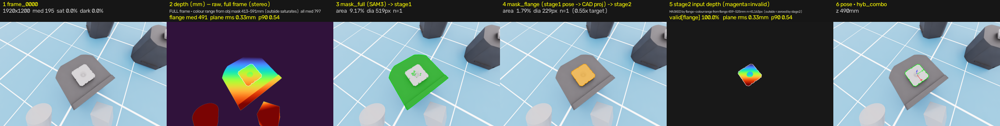
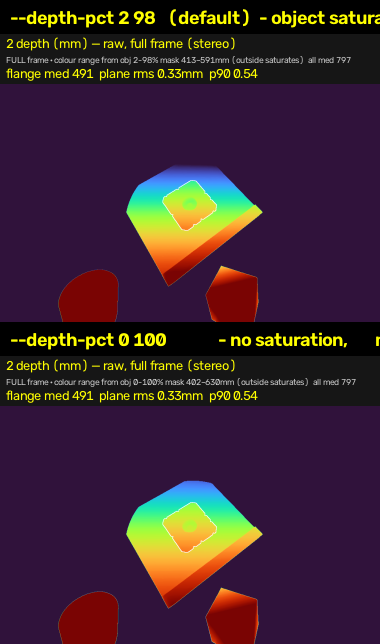

# FOUP 6D Pose 파이프라인 — 설계 근거와 검증 결과 (배포 후보 `RH1` 기준)

> **문서 성격**: 사내 공유용. **본문은 「문제 정의 → 핵심 설계 넷 → 검증」** 이고,
> 구현 선택(스테레오 백엔드·배율·노브·프롬프트 스윕 경위)은 **부록 A~G 에 QnA 로** 뺐다.
> **정본**: 측정치는 `RESULTS.md`, 선정 근거는 `RH_RATIONALE.md`, 코드 지도는 `IMPLEMENTATION_MAP.md`.
> ★ **용어·계산이 막히면 `CONFLUENCE_QNA.md`** — NP·접지·presence token·임베딩 같은 용어와
> «왜 `/2` 가 `/160` 이 되나» 같은 계산을 푼 부록이다.
> 이 문서는 그것들의 **요약이고 수치를 새로 만들지 않는다.** 최종 갱신 **2026-09-03**.
>
> 🔴 **읽기 전 한 줄**: 정확도 수치는 **전부 sim GT 대비**다. **실물에는 GT 가 없어서 절대 정확도를 잰 적이 없다.**
> 실물에서 확인된 것은 «동작한다 · 대실패가 없다 · 눈으로 맞다» 까지다.
>
> ⚠️ **절 번호 주의** — «**논문 §3.3**» 처럼 «논문» 이 붙은 것은 **인용한 논문의 절 번호**이고,
> 그냥 «**§4**» 는 **이 문서의 절 번호**다. 숫자가 겹치니 앞에 «논문» 이 있는지부터 본다.
> 논문 인용은 전부 **원문 확인**(2026-09-02)이고 줄 번호 17개를 그날 코드에 재대조했다.
> 인용 논문 셋 — Wen, Yang, Kautz, Birchfield, **FoundationPose**, CVPR 2024 (arXiv:2312.08344) ·
> Ravi et al., **SAM 3**, arXiv:2511.16719v2 · Wen et al., **FoundationStereo**, CVPR 2025 (arXiv:2501.09898).
> 전부 `docs/papers/` 에 있다. **절 번호가 겹치므로 어느 논문인지 문맥에서 확인할 것**
> (§4·§5 = FoundationPose · §3·§6 = SAM 3 · 부록 A = FoundationStereo).

---

## 0. 한 장 요약

세 기반모델(FoundationStereo → SAM3 → FoundationPose)을 그대로 이으면 동작은 하지만 **네 가지가 열려 있다**.
우리가 더한 것은 그 넷에 각각 대응하는 **설계 넷**이고, 기반모델 저장소는 **한 줄도 수정하지 않았다.**

| # | 열린 문제 | 우리 설계 | 근거의 성격 |
|:-:|---|---|---|
| ① | **CAD→실물 갭** — sim 으로 만든 참조가 실물에서 안 통한다 | **SAM3 텍스트 프롬프트 접지** (참조 자산 0) | 🟢 SAM3 논문 §1·§2·§3 + 3표본 실험 |
| ② | **평행이동 정밀도** — `full` 메쉬 기준 네트워크 1px = **4.34mm**, 실측 t 가 **2.3~3.2mm 바닥**에 붙고 거리로 안 내려간다 | **2단계 메쉬 교체** `full` → `top_flange` (3.16배) | 🟢 FP 논문 §3.3 + `Utils.py:605` |
| ③ | **회전 vs 평행이동** — 한 단계에서 둘 다 최적일 수 없다 | **하이브리드 접합** `R`=stage1 · `t`=stage2 | 🟢 FP 논문 §5.3 + `Utils.py:850` |
| ④ | **같은 물체가 여럿** — «어느 것이 타깃인가» 를 모델이 못 푼다 | **인스턴스 선택 규칙** (모델 밖의 문제임을 규정) | 🟢 SAM3 논문 §2 정의 + 🔴 규칙은 우리 것 |

**결과** — sim GT 기준 **ADD 중앙 1.1~2.3mm**(거리 0.29~0.85m), **KPI 예산의 16~27%** 만 쓴다.
**실물 20/20 프레임 통과**(육안 확인). ⚠️ **ADD 를 KPI 5mm 와 직접 견주지 말 것** — ADD 는 `full.ply`
기준이고 KPI 는 flange 좌표계다(§8 머리말).
🔴 **단 ③은 «단계 구성이 KPI 를 얼마나 올렸나» 로 주장할 수 없다** — 8거리 552프레임에서
`refined` 단독이 하이브리드보다 **ADD 0.119mm(KPI 의 2.4%) 낫다**(§8.1). ③의 유효한 서술은
«**R·t 를 갈라 받을 수 있는 구조를 만들었고 그 근거가 논문 §5.3 에 있다**» 까지다. 🔴 그리고 **KPI 를 실제로 지배하는 것은 ①②③ 이 아니라 ④** 였다 —
거리별 KPI 곡선이 **오선택 곡선의 거울상**이었다(§6).

### 0.1 근거의 성격 — 한눈에

🟢 **논문 + 코드** / 🟡 **코드만**(논문에 없음) / 🔴 **우리 측정뿐**. 아래가 전체 감사표다.

| 절 | 구성요소 | 근거 |
|---|---|---|
| §3 | 프롬프트 `f002` (텍스트 접지) | 🟢 **SAM3 논문 §1·§2·§3** + 3표본 실험 |
| §4 | crop = 물체 지름 → 유효 해상도 | 🟢 **FP 논문 §3.3 + supplementary p14**(160×160) + `Utils.py:605`. 🔴 `crop_ratio` 값 1.2/1.1 은 설정 파일에만 |
| §5(가) | 갱신 보폭 비대칭 | 🟢 **코드 + config 원문** — 회전 20.000000° · 평행이동 `mesh_diameter/2`. 🟡 **논문과의 관계**: 두 상수가 논문 p14 의 학습 교란과 **정확히 일치**하는데, 평행이동 쪽은 **배포 설정이 그 경로를 껐다**(`normalize_xyz: true`) |
| §5(나) | R·t 접합 **가능성** (하이브리드) | 🟢 **FP 논문 §5.3** + `Utils.py:850`. 🔴 **«이득» 은 별개다** — 8거리에서 `refined` 단독이 근소하게 낫다(§8.1) |
| §6 | 인스턴스 선택 규칙 | 🟢 **두 논문이 각자 «내 밖» 이라 명시**(SAM3 §2 «모든 인스턴스» 정의 · FP §5.4 Limitations «external 2D detection 이 병목») + 🔴 규칙 자체는 우리 것 |
| §7.1 | 마스크는 «평행이동만» 초기화한다 | 🟢 **FP 논문 §3.3 원문** + `estimater.py:137·131` + 🔴 우리 반사실 측정 |
| §7.2 | upstream 사용법과의 차이 5개 | 🟢 **`run_demo.py:51-63`** + 논문 초록·§5.4 |
| §7.3 | stage1 ↔ stage2 는 **다른 함수**다 | 🟢 **`estimater.py:159`(register) ↔ `:250`(track_one)** — scorer·마스크·회전탐색 유무 |
| 부록 A | 스테레오 전·후처리 | 🟢 **FoundationStereo 논문 §3.1 + upstream 코드**(정규화 상수·패딩 32) · 🔴 배율·범위 게이트는 우리 측정 |
| 부록 B | `--input-scale` | 🟡 `erode/bilateral radius=2` 는 코드만 + 🔴 우리 측정 |
| 부록 D | stage2 입력 depth 처리 | 🟡 depth denoising **존재는 논문 p13**, `radius=2` 픽셀 단위는 코드만 + 🔴 우리 측정 |

🔴 **«우리 것» 이라고 써야 하는 항목은 하나뿐이다** — **인스턴스 선택 규칙**(§6).
(평행이동의 지름 정규화는 **upstream 배포 설정**이지 우리 선택이 아니다 — §5(가)④에서 정정됐다.)
앞의 것은 *«공개 구현의 학습 설정»* 이라고만 쓸 수 있고, 뒤의 것은 **두 논문이 각자 «내 과제 밖» 이라고
명시한 자리**다 — 즉 «근거 없는 자유 파라미터» 가 아니라 **시스템이 메워야 하는 정의된 빈칸**이다.

### 0.2 📂 인용한 upstream 파일 위치

본문·부록이 줄 번호로 인용하는 파일은 **전부 `third_party/` 안**이다(우리 코드가 아니다).
경로를 안 적으면 찾기 어려워서 한곳에 모은다 — 기준 경로는 **`src/vision/`** 이다.

| 문서에 쓰는 이름 | 실제 경로 |
|---|---|
| `estimater.py` | `third_party/FoundationPose/estimater.py` |
| `Utils.py` | `third_party/FoundationPose/Utils.py` |
| `run_demo.py` | `third_party/FoundationPose/run_demo.py` |
| `datareader.py` | `third_party/FoundationPose/datareader.py` |
| **`predict_pose_refine.py`** | **`third_party/FoundationPose/learning/training/predict_pose_refine.py`** |
| `predict_score.py` | `third_party/FoundationPose/learning/training/predict_score.py` |
| `core/foundation_stereo.py` | `third_party/FoundationStereo/core/foundation_stereo.py` |
| `sam3_image_processor.py` | `third_party/sam3/sam3/model/sam3_image_processor.py` |
| `README:51` (SAM3) | `third_party/sam3/README.md` |
| 배포 가중치 설정 | `third_party/FoundationPose/weights/2023-10-28-18-33-37/config.yml`(refiner) · `…/2024-01-11-20-02-45/config.yml`(scorer) |

★ **우리 코드**는 `spatial_vision/` 밑이다 — `stages/pose_fp.py` · `stages/segment_sam3.py` ·
`stages/stereo_onnx.py` · `eval/hybrid_pose.py` · `contracts.py` (→ `IMPLEMENTATION_MAP.md`).
🔴 **`third_party` 는 읽기 전용이다** — 파일 수정 0줄이 이 프로젝트의 불변식이다(§7.2).

---

## 1. 과제와 합격 기준

300mm FOUP 의 **6D pose**(위치 3 + 자세 3)를 CAD 와 스테레오 영상만으로 추정한다.

### 1.1 출력이 정확히 무엇인가 — `cam_T_obj`

| | 정의 |
|---|---|
| **도착점 (물체)** | **top flange 의 «주 상판» 윗면 중심**, 중심축 위 |
| **출발점 (카메라)** | 🔴 **좌측 정류(rectified) 카메라의 광학 중심** — 하우징 중심도, 베이스라인 중점도 아니다 |
| 축 | OpenCV 관례 — **+X 오른쪽 · +Y 아래 · +Z 전방** |
| 값 | `R` 3×3 row-major + `t` **mm** (BOP 관례) |

🔴 **«주 상면» 은 융기가 아니라 «주 상판(중간 바디)의 윗면» 이다.** 메쉬 실측:
위를 향하는 면적의 **90.9% 가 z = 0**(주 상판)이고, **최외곽 융기와 중심홀 융기는 z = +2.00mm** 로 **그보다 위**다.


> **그림 1.** `top_flange.ply` 수직 단면. 빨강 점이 pose 원점(z=0, 주 상판 윗면)이고 융기 둘은 +2mm 위에 있다.
> 중심홀 융기는 **둥근 능선이라 평평한 면이 없고**, 최외곽 융기만 평평한 꼭대기(850mm²)를 갖는다.

⚠️ **줄자로 «카메라 → FOUP» 거리를 잴 때 좌측 렌즈의 광학 중심에서 재야 한다.** 실물에서 `t_z` 가
줄자보다 **+10~14mm** 큰 계통 편향이 **미해결**인데 **이 기준점 규약이 후보 중 하나**다(→ §10-8).

### 1.2 합격 기준

로봇이 flange 를 파지해야 하므로 기준은 그 좌표계에서 정의된다.

| 지표 | 기준 |
|---|---|
| Translation error | **≤ 5 mm** |
| Rotation error | **≤ 3°** |

🔴 **이 두 숫자는 좌표계에 딸린 값이다.** 회전 3° 가 물리적으로 얼마인지는 원점에서의 거리에 비례한다
(`d = 2·r·sin(θ/2)`):

| 3° 일 때 표면 최대 변위 | 값 |
|---|---|
| **flange 표면** (r ≤ 91.8mm) | **4.81 mm** ≈ t 예산 5mm |
| 몸체 전체 표면 (r ≤ 427.3mm) | **22.37 mm** = t 예산의 4.5배 |

→ **두 항이 균형을 이루는 것은 flange 좌표계에서만**이다. KPI 와 원점 규약은 분리해서 인용할 수 없다.


> **그림 2.** (왼쪽) 회전 3° 가 표면을 얼마나 움직이나 — flange 에서 **4.81mm** 로 평행이동 예산 5mm 와
> 균형이 맞지만, 몸체 전체에서는 **22.37mm** 로 회전이 지배한다.
> (오른쪽) 배포 후보 `RH1` 의 실제 소진 — **예산의 16~27%**(sim GT, 거리당 n=80). 여유가 크다.

⚠️ 합격 기준 자체는 **과제 요건으로 주어진 값**이고 본 연구가 유도한 것이 아니다. 유도하려면
«파지 기구의 포획 반경» 한 값이 더 필요하다(→ `RH_RATIONALE.md §8`).

---

## 2. 문제 정의 — 단순 연결의 한계

### 2.1 기본 조합

```
FoundationStereo → SAM3 → FoundationPose
```

세 기반모델을 그대로 이으면 **동작은 한다.** 다만 그대로 두면 다음이 열려 있다.

| # | 열린 문제 | 그대로 두면 | 대응 |
|:-:|---|---|---|
| ① | **CAD→실물 도메인 갭** | sim 렌더로 만든 **exemplar 참조가 실물에서 전멸**했다(§9.1) | §3 |
| ② | **평행이동 정밀도** | `full` 메쉬 기준 **네트워크 1px = 4.34mm** → 실측 t 가 **2.3~3.2mm** 에서 멈추고 **거리로 안 내려간다** | §4 |
| ③ | **회전 vs 평행이동** | 한 단계에서 **둘 다 최적일 수 없다** — 갱신 보폭이 비대칭이다 | §5 |
| ④ | **같은 물체가 여럿** | *"어느 FOUP 이 타깃인가"* 를 **모델이 못 푼다** (과제 정의상) | §6 |

(⑤ 스테레오 저장소가 research-only 라 상업 경로가 막히는 문제는 **구현 선택**이라 → **부록 A**.)

### 2.2 우리가 더한 것

```
① SAM3 텍스트 접지                      ─ CAD→실물 갭 (참조 자산 0)
② pose_fp 2단계 (메쉬 교체 full→flange) ─ 평행이동 해상도 3.16배
③ 하이브리드 (R=stage1 · t=stage2)      ─ 회전·평행이동을 각각 최적 단계에서
④ 인스턴스 선택 규칙                     ─ "어느 것이 타깃인가"
(+ stereo NGC ONNX 전·후처리 재구현      ─ 상업 경로, 부록 A)
```

🟢 **네 기반모델 저장소 모두 소스 수정 0줄**이다(`git status` 로 확인, → `RH_RATIONALE.md §9`).
우리 코드는 **스테이지 3 + 병합 1 + 공유 규약 1** 이 전부다.

| 파일 | 줄 수 | 역할 |
|---|--:|---|
| `stages/stereo_onnx.py` | — | ONNX 세션 + **전·후처리 직접 구현** (repo 코드 미사용, 부록 A) |
| `stages/segment_sam3.py` | — | 텍스트 질의 + **인스턴스 선택** (§3·§6) |
| `stages/pose_fp.py` | ~470 | **2단계 조립** (메쉬 교체·씨앗 주입·입력 처리) (§4) |
| `eval/hybrid_pose.py` | **85** | **R·t 접합** (추론 0, 파일 병합) (§5) |
| `contracts.py` | 245 | 스테이지 경계의 **유일한 공유 코드** (스키마 + 선택 규칙) |

★ **가장 큰 효과를 내는 부품이 가장 작다** — `hybrid_pose.py` 는 85줄이고 GPU 를 안 쓴다.

---

## 3. 핵심 설계 ① — CAD→실물 갭을 **텍스트 접지**로 넘는다

> **문제**: 분할이 «무엇이 FOUP 인가» 를 알려면 참조가 필요한데, 그 참조를 sim 렌더나 CAD 템플릿으로
> 만들면 **도메인 갭을 그대로 물려받는다.** 실사진으로 참조를 만드는 것은 배포 부담이 크다.

**설계**: SAM3 에 **짧은 명사구(NP)** 하나만 준다. 참조 이미지·CAD 템플릿을 **전혀 쓰지 않는다.**
채택한 문장은 **`cube shaped sealed plastic wafer pod`** (내부 slug `f002`).

**(가) SAM3 는 «짧은 명사구» 를 받도록 설계됐다** — 🟢 **논문 원문**

> Ravi et al., **SAM 3: Segment Anything with Concepts**, arXiv:2511.16719v2 (`docs/papers/`)

| 위치 | 원문 |
|---|---|
| **§2 과제 정의** (p3) | *"…**detect, segment and track all instances** of a visual concept specified by a short text phrase, image exemplars… **We restrict concepts to those defined by simple noun phrases (NPs) consisting of a noun and optional modifiers.**"* |
| **§1 서론** (p2) | *"To focus on recognizing **atomic visual concepts, we constrain text to simple noun phrases (NPs)** … While **SAM 3 is not designed for long referring expressions or queries requiring reasoning**…"* |
| **§3 Presence Token** (p4) | *"…**p(NP is present in input)** … Each proposal query qᵢ only needs to solve **p(qᵢ is a match \| NP is present in input)**. **The final score … is the product of its own score and the presence score.**"* |
| **§2** (p3) | *"Our vocabulary includes any simple noun phrase groundable in a visual scene, **which makes the task intrinsically ambiguous** … subjective descriptors ('cozy', 'large')…"* |

★ **«NP = 명사 + 선택적 수식어» 가 논문의 정의**다 — 아래 (나)의 규칙들이 그 정의의 따름정리다.
(보조: 저장소 `README:49·351`, `agent_core.py:238` 실패 시 *"simple noun phrase"* 로 재시도.)

**(나) 우리 경험 규칙 — 그리고 «그렇게 해석한 근거»**

> **근거 표시**: 🟢 **P** 논문·저장소 원문 / 🟡 **P⇒** 논문이 밝힌 사실에서 **연역** /
> 🔵 **E** 실험적 추론(**대조군이 있는** 우리 측정) / 🔴 **H** 가설(확인 수단이 없다).
> 🔴 **«규칙» 과 «그 규칙의 기전» 은 근거 강도가 다를 수 있어 따로 적는다.**

| 측정된 규칙 (측정 근거) | 설계로부터의 설명 | **그렇게 해석한 근거** |
|---|---|---|
| **약어 단독은 죽는다** — `FOUP` **0/9** ↔ `front opening unified pod` **9/9**<br>🔵 **짝 대조**(같은 개념·표기만 다름) · `flange` 대상에서도 재현(`robotic handling flange` 0/9) | SA-Co 라벨이 **사람이 쓰는 NP 표층형**이라 약어는 그 분포에 거의 없다 | 🔵 **E 규칙은 강함** — 짝 대조 + 다른 부품에서 재현<br>🔴 **H 기전은 미확인** — 학습 데이터 분포를 직접 못 본다<br>⚠️ **부분 반례**: `Entegris FOUP` 은 **5/9** 로 일부 산다(상표가 닻이 된다) |
| **형상어는 «수식어 자리» 에서만 접지된다** — `cube shaped case` **9/9** ↔ **`plastic cube` 0/9**<br>🔵 **통제 비교** — 낱말 `cube` 는 그대로 두고 **자리만** 바꿨다 | NP = `[modifier*] + HEAD`. `plastic cube` 는 **head 가 `cube`** 라 «진짜 정육면체» 를 찾으러 간다 — FOUP 은 정육면체«처럼 생긴 통» 이다 | 🟢 **P 논문 §2 정의**(*"a noun and optional modifiers"*)<br>🔵 **E 통제 비교** — 한 변수만 바꾼 짝<br>★ **둘 다 있어 이 표에서 가장 강하다** |
| **핵명사를 빼면 «검출 자체» 가 깨진다** — 5낱말 원본 9/9 → **`pod` 제거 시 7/9**<br>🔵 **길이 통제** — 제거 후보 5개가 **전부 4낱말**인데 `pod` 만 검출이 깨지고 나머지는 **여유(score 최소)만** 줄었다(0.065~0.812, 12배) | **head 가 후보 집합을 정하고 modifier 는 좁힐 뿐**이다. head 가 빠지면 «무엇을 찾을지» 가 사라진다 | 🟢 **P 정의** — noun 은 **필수**, modifier 는 **optional**<br>🔵 **E 길이 통제 제거 실험**<br>⚠️ 🔴 **초판이 틀렸다** — «곱셈적 기여» 로 읽었는데 **2낱말 제거를 1낱말로 착각**한 것이었다(§37-15-1 에서 정정) |
| **슬롯별 최적을 조합하면 최적이 안 나온다** — `cube shaped` 는 `pod` 과 **1위**인데 `case` 와는 **꼴찌** | phrase 를 **통째로 임베딩**한다 — 낱말별 기여의 합이 아니다 | 🔵 **E 규칙은 관측 자체가 증거** — «조합이 예측과 어긋난» 실례이므로 **«분해 가능» 이 반증**됐다<br>🔴 **H 기전은 추정** — 텍스트 인코더 내부를 확인하지 않았다. *"통째 임베딩이라서"* 는 **그럴듯한 설명**이지 확인된 원인이 아니다 |
| **색어는 조건부다** — 제 색에서만 걸리고 아니면 **조용히 검출 0**. 맞는 색이어도 여유를 깎는다(`black` 추가 시 `score` 최소 **0.977 → 0.420**) | presence token 이 «개념이 있나» 를 따로 판단하고 **최종 점수에 곱해진다** → 속성이 어긋나면 후보 점수와 무관하게 눌린다 | 🟢 **P 논문 §3 분해식** — `final = p(매치\|존재) × p(존재)` (**곱셈**)<br>🟢 **P 저장소 `README:51`** — presence token 이 *"improves discrimination between closely related text prompts (e.g., **'a player in white' vs. 'a player in red'**)"* — **예시가 정확히 «색 속성 구분»** 이다<br>🟢 **P 논문 §1** — 학습에 **hard negatives** 를 넣었고 ablation 에서 효과 확인<br>★ **이 표에서 근거가 가장 두껍다** |
| **영어 전용** — 한국어·일본어·독일어 **전부 0/9** | SA-Co 가 **영어 NP** 데이터셋이다 | 🔵 **E 규칙은 명확** — 3개 언어 × 9장 전부 0<br>🔴 **H 기전은 간접** — 논문이 밝힌 것은 *"annotators were proficient in English"* · *"minimum B-2 English proficiency"* 까지다. **«영어 전용 데이터셋» 이라는 문장은 논문에 없다** |
| **제조사명은 해롭다** — `Entegris cube shaped …` 가 웹 **9장에서 1위**(score 0.988) → **237장에서 51위** | 상표는 «물체» 가 아니라 **«그 회사 제품의 외관»** 과 결합한 spurious correlation 이다 | 🔵 **E 강함** — **«표본을 넓히면 무너진다» 가 spurious correlation 의 정의적 증상**이고, 9장이 실제로 **그 제조사 제품**이었다는 사실이 대안 설명(«9장이 우연히 쉬웠다»)보다 이 설명을 지지한다<br>🟡 **P⇒** 개념 자체는 표준 ML 용어의 적용이다<br>🔴 상표 낱말이 외관과 결합했음을 **직접** 확인한 것은 아니다 |

★ **표를 읽는 법** — 왼쪽 열은 *"측정했다"*, 가운데는 *"이렇게 설명한다"*, 오른쪽은 *"그 설명을 뭘 보고
했나"* 다. 🔴 **오른쪽이 🔴 인 셋**(약어 기전 · 슬롯 조합 기전 · 영어 전용 기전)**은 보고서에서
«논문이 그렇게 말한다» 로 쓰면 안 된다** — *"측정 결과가 이렇고, 논문이 밝힌 설계와 정합적이다"* 로 쓴다.
용어·강도 해설은 `CONFLUENCE_QNA.md §4·§13~15`.

**(다) 그래서 `f002` 는 설계 요건의 교집합이다**

| 요건 | 충족 |
|---|---|
| 짧은 명사구(문장 아님) | 6단어 NP ✅ |
| 도메인 head noun | `pod` · `wafer` ✅ |
| 형상 접지가 **수식어 자리** | `cube shaped` ✅ |
| 재질·상태 수식어 | `sealed` · `plastic` ✅ |
| **약어 · 색어 · 마침표 · 제조사명 없음** | ✅ |

**(라) 검증 — 이 설계가 실제로 갭을 넘었다**

- ★★ **sim 으로 만든 exemplar 참조는 실물에서 전멸했다.** 텍스트가 **유일하게 살아남은 SAM3 경로**다(§9.1).
- **표본 셋에서 같은 답이 나왔다** — 웹 237장(서열화) · sim GT(pose 채점) · 실물 3라운드(좁히기).
  실물에서 **136 → 81 → 70 → 58 → 12 → 4** 로 좁혔고 `f002` 가 **웹·실물 양쪽 1위**다.
  (스윕 경위 상세 → **부록 E**)
- 🔴 **프롬프트를 바꿔도 pose 는 거의 안 바뀐다** — sim GT 채점에서 프롬프트별 R 중앙 0.43~0.60° ·
  t 중앙 1.89~1.98mm 로 **구분되지 않았다.** 갈리는 축은 **«검출되느냐» 하나**이고, 그게 곧 KPI 다.

---

## 4. 핵심 설계 ② — 평행이동의 **구조적 천장**을 메쉬 교체로 넘는다

> **문제**: FoundationPose 의 유효 해상도는 **거리에도 `fx` 에도 무관**하고 **메쉬 크기가 정한다.**
> 그래서 `full` 메쉬로만 돌리면 t 오차에 천장이 생기고, **카메라를 가까이 가져가도 안 낮아진다.**

**(가) 먼저 «무엇이 정밀도를 정하나»** — refiner 신경망은 입력이 **160×160 고정**이다(🟢 논문 p14).
1920×1200 사진에서 **어디를 얼마나 확대해 그 160px 에 넣을지**를 정하는 것이 `crop` 이고,
**160px 이 실제 몇 mm 를 담느냐가 곧 «네트워크가 볼 수 있는 최소 단위»** 다.

**(나) 🟢 논문은 «2D 검출 박스로 자르지 않는다» 고 명시한다** — §3.3 *Pose Refinement*:

> *"For the input observation, **instead of cropping based on the 2D detection which is constant,
> we perform a pose-conditioned cropping strategy so as to provide feedback to the translation
> update.** Concretely, we project the object origin to the image space to determine the crop center.
> We then project the **slightly enlarged object diameter (the maximum distance between any pair of
> points on the object surface)** to determine the crop size…"*

★ 이 문단에 셋이 다 있다 — **① 무엇으로 자르나**(2D 박스가 아니라 **물체 지름**) ·
**② 중심은 어디**(물체 원점의 투영) · **③ 왜**(평행이동 갱신에 **피드백**을 주려고).
🔴 **③이 핵심이다**: crop 이 pose 에 딸려 움직이므로 t 가 틀리면 crop 이 어긋나 보이고,
네트워크가 그걸 보고 t 를 민다. 2D 박스로 고정하면 물체가 늘 crop 한가운데라 **그 신호가 안 생긴다.**

코드가 그 문장 그대로다 — `Utils.py:605`:
```python
radius = mesh_diameter * crop_ratio / 2      # crop 을 3D 에서 정의한다
```
그 창을 `input_resize`(=**160**)로 줄인다(`Utils.py:597`). 🟢 **이 값도 논문에 있다** — supplementary p14:
*"cropped based on the perturbed pose and **resized into 160 × 160** before sending to the network."* 따라서

```
네트워크 1px = mesh_diameter × crop_ratio / 160  [mm]     ← 거리에도 fx 에도 무관
```

| 메쉬 | `mesh_diameter` | crop 물리 폭 (`× 1.2`) | ÷160 | refiner 1px |
|---|--:|--:|--:|--:|
| `full.ply` | 579.0 mm | 694.8 mm | ÷160 | **4.34 mm** |
| `top_flange.ply` | 183.5 mm | 220.2 mm | ÷160 | **1.38 mm** |

**(다) 거리가 바뀌면 «자르는 픽셀 수» 는 변하는데 «1px 의 mm» 는 안 변한다** (`--input-scale 0.75`, 근사):

| 메쉬 | 거리 | 원본에서 자르는 폭 | 160px 로 | 네트워크 1px |
|---|--:|--:|--:|--:|
| `full.ply` | 291mm | **1303 px** | 8.1배 축소 | **4.34 mm** |
| `full.ply` | 613mm | 618 px | 3.9배 축소 | **4.34 mm** |
| `full.ply` | 850mm | 446 px | 2.8배 축소 | **4.34 mm** |
| `top_flange.ply` | 613mm | **196 px** | **1.2배**(거의 등배) | **1.38 mm** |

★★ **같은 사진인데 `full` 은 618px 을 160px 로 3.9배 뭉개고, `flange` 는 196px 을 거의 그대로 본다.**
이것이 «메쉬를 갈아타면 세밀해진다» 의 실체다. (단계별 풀이 → `CONFLUENCE_QNA.md §17`)

**설계**: stage1 은 `full.ply` 로 전체를 잡고, **stage2 에서 메쉬를 `top_flange.ply` 로 갈아탄다.**
→ ★ **유효 해상도가 3.16배 좋아진다.** 거리를 당겨서가 아니라 **메쉬가 작아서**다.

⚠️ **«1px = 4.34mm» 는 «오차 하한» 이 아니라 «눈금» 이다** (2026-09-03 명확화). 네트워크가 내놓는
`trans_delta` 는 **연속 회귀값**이라 서브픽셀이 가능하고, 실측 `--primary full` 의 t 는
**2.34~3.25mm = 0.54~0.75 px** 로 **항상 1px 보다 작다.** 🔴 **진짜 뜻은 «이 대역 아래로 못 내려간다»**
— 0.29m ↔ 0.85m 로 **2.9배** 멀어져도 t 변화폭이 **0.91mm** 뿐이다. 그래서 «천장» 보다 **«바닥»** 이
정확한 말이고, 내리는 방법은 **눈금을 바꾸는 것**(= 메쉬 교체)뿐이다 → 0.291m 에서 **0.714mm**.
풀이는 `CONFLUENCE_QNA.md §16`.

**(라) ⚠️ «crop 용 pose 추정» 이 따로 있는 것이 아니다** — crop 은 **현재 pose 로 매 반복 다시**
계산된다(`predict_pose_refine.py:182-183` 이 반복 안에서 `make_crop_data_batch` 를 부른다).
🟢 논문도 *"feeding the latest updated pose as input to the next inference"* 라 적는다.
**신경망 없이 만든 초기값 하나**(마스크 t + 회전 격자)에서 출발해 **crop 과 pose 가 같이 좋아진다.**
→ 풀이 `CONFLUENCE_QNA.md §18`.

★ 코드에서 이 구성을 만드는 스위치가 **`--primary full`** 이다(`pose_fp.py:290`) — stage1 의 메쉬·마스크를
고르고, **stage2 는 `--primary` 와 무관하게 항상 `top_flange.ply`** 다(`pose_fp.py:299`).

**부수 효과 — flange 마스크를 분할에서 받지 않는다.**
stage2 의 flange 마스크는 **`top_flange.ply` 를 stage1 pose 로 투영**해 만든다(`--flange-mask-from pose`).
→ ★ **`RH1` 은 SAM3 의 flange 검출에 전혀 의존하지 않는다.** 실물에서 flange 프롬프트는 20개 중 **2개**만
살아남았는데, 이 설계가 그 취약축을 **아예 안 밟는다**. (마스크 밖 depth 처리 상세 → **부록 D**)

**★★ 반증 가능한 예측을 세우고 시험했다**

> 위 설명이 옳다면 — **`--primary flange` 로 돌리면 stage1·stage2 가 «같은 메쉬」라 이득이 사라져야 한다.**

측정: `--primary flange` 에서 stage2 의 t 이득이 **1.100 → 1.042mm (0.058mm)** 인데
**FP 재실행 잡음 바닥이 0.512mm** 다 → **측정되지 않는다.** ✅ **예측대로 사라졌다.**

★ 이것이 *"단계를 하나 더 두면 좋다"* 가 아니라 ***"그 단계가 메쉬를 갈아타기 때문에 좋다"*** 를 구분한 증거다.

---

## 5. 핵심 설계 ③ — 회전과 평행이동을 **각각 최적인 단계에서** 받는다

> **문제**: §4 의 메쉬 교체는 공짜가 아니다. `top_flange` 는 근사 4회 대칭이고
> **방향 정보가 표면의 3.5%·전부 경계**에 있다. 즉 **stage2 는 «회전 증거» 를 «평행이동 해상도» 와 맞바꾼다.**

**(가) 왜 비대칭인가 — 🟢 코드 + 설정 파일 (그리고 논문과 정확히 맞물린다)**

> 📂 **파일 위치**: `third_party/FoundationPose/learning/training/predict_pose_refine.py`
> (upstream 저장소 안이라 우리 `spatial_vision/` 밑에는 없다 → 전체 목록은 §0.2)

**① 먼저 «어느 가중치인가»** — FoundationPose 는 **가중치를 둘** 쓰고, 코드에 이름이 박혀 있다:

| 네트워크 | `run_name` | 파일 | `crop_ratio` | `rot_normalizer` |
|---|---|---|---|:-:|
| **refiner** (pose 를 고친다) | **`2023-10-28-18-33-37`** | `predict_pose_refine.py:97` | **1.2** | ✅ **있다** |
| scorer (후보를 채점한다) | `2024-01-11-20-02-45` | `predict_score.py:120` | 1.1 | ❌ **없다** |

🔴 **`rot_normalizer` 가 2024 설정에 없는 것이 맞다** — 그건 **scorer** 이고 pose 델타를 안 내므로
정규화 상수가 필요 없다. **이 절은 전부 refiner(2023) 이야기**다.
⚠️ 그리고 **stage2 는 scorer 를 아예 안 부른다**(§7.3) — stage2 에서는 2023 가중치만 관여한다.

**② 배포 설정값** (`weights/2023-10-28-18-33-37/config.yml` 원문):

```yaml
rot_rep: axis_angle          trans_rep: tracknet         normalize_xyz: true
crop_ratio: 1.2              input_resize: [160, 160]
rot_normalizer:   0.3490658503988659          # = 20.000000°
trans_normalizer: [0.02, 0.02, 0.05]          # 🔴 존재하지만 **안 쓰인다** (아래 ③)
```

**③ 코드가 그 설정으로 어느 분기를 타는가** (`predict_pose_refine.py:195-229`):

```python
if cfg['trans_rep']=='tracknet':          # ✅ tracknet 이다
    if not cfg['normalize_xyz']:          # ❌ normalize_xyz 가 true → 이 줄은 건너뛴다
        trans_delta = tanh(out["trans"]) * trans_normalizer     # 🔴 «꺼진» 경로
    else:
        trans_delta = out["trans"]        # ✅ 여기 — tanh 도 상수배도 없다
if cfg['rot_rep']=='axis_angle':          # ✅
    rot_mat_delta = tanh(out["rot"]) * cfg['rot_normalizer']    # ✅ ×20° 상수
if cfg['normalize_xyz']:                  # ✅
    trans_delta *= (mesh_diameter / 2)    # ✅ 여기 — 메쉬 크기에 비례
```

| | 실제로 곱해지는 것 | 값 | 메쉬 크기 의존 |
|---|---|---|:-:|
| **평행이동** | **`mesh_diameter / 2`** | `full` **289.5mm** · `flange` **91.75mm** | ✅ |
| **회전** | `rot_normalizer` **상수** | **20.000000°** | ❌ |

★ **이것이 §5 의 전부다** — 메쉬를 3.16배 작게 바꾸면 **평행이동 보폭만 3.16배 세밀해지고 회전 보폭은 그대로**다.

**④ 🟢 논문과의 대조 — 두 상수가 «학습 교란 크기» 와 정확히 같다** (supplementary p14):

> *"the pose is randomly perturbed by adding **translation noise under the magnitude of 0.02m, 0.02m,
> 0.05m** for XYZ axis respectively and **rotation under the magnitude of 20°**"*

| 논문의 학습 교란 | config 값 | 일치 | 실제 사용? |
|---|---|:-:|:-:|
| 회전 **20°** | `rot_normalizer` = 0.3490658503988659 rad = **20.000000°** | ✅ | ✅ **쓴다** |
| 평행이동 **0.02 / 0.02 / 0.05 m** | `trans_normalizer` = **[0.02, 0.02, 0.05]** | ✅ | 🔴 **안 쓴다** |

★★ **정정 (2026-09-03)** — 이전 판은 *"평행이동의 지름 정규화는 논문 근거가 없다"* 라고만 썼는데
**더 정확히 말할 수 있다**: **논문이 말한 0.02/0.02/0.05 m 는 config 에 `trans_normalizer` 로 그대로 있고,
배포 설정이 `normalize_xyz: true` 로 그 경로를 «껐다».** 즉 «논문에 없는 값» 이 아니라
**«논문의 값을 쓰지 않기로 한 선택»** 이다. 그 선택 자체는 여전히 논문에 설명이 없다.

**(나) 그래서 R 과 t 를 갈라 써도 되나 — 🟢 논문 §5.3 + 코드**

> 논문 §5.3 (supplementary): *"this **disentangled representation removes the dependency on the
> updated orientation when applying the translation update**."*

`Utils.py:850-856`:
```python
B_in_cam[:,:3,3]  = A_in_cam[:,:3,3] + trans_delta       # t ← t + Δt   (R 이 안 낀다)
B_in_cam[:,:3,:3] = rot_mat_delta @ A_in_cam[:,:3,:3]    # R ← ΔR · R   (t 가 안 낀다)
```
→ ★ **한 단계의 `R` 과 다른 단계의 `t` 를 접합해도 각각이 그 단계에서 최적화된 값 그대로 유지된다.**
🔴 물체 좌표계 갱신(`t ← R·Δt + t`)이었다면 접합이 의미를 잃는다 — **이 파라미터화가 전제 조건**이다.

**설계**: `hybrid_pose.py`(85줄, 추론 0)가 **`R` 은 `pose_coarse.json`(stage1)에서, `t` 는
`pose_refined.json`(stage2)에서** 가져와 합친다. 이것이 `RH1` 의 최종 출력이다.

**검증** → §8.1.

---

## 6. 핵심 설계 ④ — «어느 것이 타깃인가» 는 **모델 밖의 문제**다

> **문제**: SAM3 는 개념에 맞는 것을 **전부** 낸다. FOUP 이 여러 대면 모델이 답할 수 없다.

**(가) 이것은 성능 한계가 아니라 과제 정의다** — 🟢 **논문 원문**

논문 §2 (p3)가 PCS 를 ***"detect, segment and track **all instances** of a visual concept"*** 로 정의한다.
즉 **«여럿 중 어느 것인가» 는 PCS 의 출력이 아니다.** 그리고 §3 (p4)의 점수 분해식
`final = p(qᵢ 가 매치 | NP 존재) × p(NP 존재)` 에서 앞 항은 ***"이 개체가 그 개념의 인스턴스인가"*** 에
답하므로 **동종 물체를 점수로 구분할 수 없는 것은 설계된 동작**이다.

🔴 **논문이 제시하는 해법은 «단일 객체 경로(PVS)» 다** — §1 (p1): PVS 는 *"points, boxes or masks to
**segment a single object per prompt**"*. ⚠️ **PCS 의 exemplar 박스는 해법이 아니다** —
*"given a positive bounding box on a dog, the model will detect **all** dogs"*(p4).
→ 어느 쪽이든 **«대략적 위치» 라는 외부 정보가 필요**하고, 현 환경엔 로봇이 없어 그 정보가 없다.

★★ **FoundationPose 쪽도 같은 말을 한다 — 자기 한계로 명시했다.** §5.4 *Limitations*(supplementary p15):

> *"our approach … **relies on external 2D detection**, which is obtained from methods such as CNOS,
> or Mask-RCNN. We observe **false or missing detection frequently bottlenecks the 6D pose
> estimation.** In future work, an end-to-end framework for novel object detection, 6D pose
> estimation and tracking would be of interest."*

→ ★ **아래 (다)의 측정은 그 «예고된 병목» 을 우리 과제에서 정량화한 것**이다.
두 논문이 각자 «이건 내 밖이다» 라고 한 자리가 정확히 겹치고, **그 자리를 시스템이 메워야 한다.**

**(나) 그래서 시스템이 규칙으로 정한다** — 🔴 **우리 휴리스틱**

`contracts.select_index()` : **점수 게이트(최고점의 `score_frac` 배 이상) → 면적 → 중앙 근접**.
현행 `--select center` + `score_frac 0.9`. (값 선택 상세 → **부록 C**)

**(다) 🔴🔴 그리고 이것이 KPI 를 실제로 지배한다 — 이 연구의 가장 큰 발견**

씬을 고정하고 **8거리 × 80프레임 × 2반복(640프레임)** 사다리를 냈다:

| 거리(m) | 0.291 | 0.393 | 0.443 | 0.491 | 0.548 | 0.597 | 0.697 | 0.850 |
|---|---|---|---|---|---|---|---|---|
| **KPI(전체)** | 80.0% | 88.8% | 82.5% | 87.5% | 86.2% | 91.2% | 92.5% | 91.2% |
| **KPI(오선택 제외)** | **62/62** | **69/69** | **64/64** | **69/69** | **68/68** | 72/73 | **74/74** | 73/74 |
| ADD 중앙 | 1.135 | 1.122 | 1.358 | 1.618 | 1.811 | 1.946 | 2.229 | 2.330 |


> **그림 3.** 씬을 고정한 8거리 사다리. **초록(오선택 제외 KPI)이 전 거리 ~100% 로 평평**하고,
> 빨강(현행)과의 **간격이 곧 오선택률**이다. 파랑은 선택 게이트만 0.3 으로 바꾼 것 — 같은 pose 단계인데
> 곡선이 평평해진다. 아래 칸은 pose 정확도(ADD)로, 거리와 함께 단조 악화하지만 **예산 근처에도 안 간다.**

🔴🔴 **«거리 최적점» 은 pose 가 아니라 «분할» 의 성질이었다.**
오선택을 빼면 KPI 가 **전 거리 ~100%**(0.291m 포함)이고, 종단 곡선은 **오선택 곡선의 거울상**일 뿐이었다.
→ **처방이 «거리를 옮겨라» 가 아니라 «선택 규칙을 고쳐라» 로 바뀐다.**

실제로 선택 규칙 하나만 바꾸면(`score_frac` 0.9 → 0.3):

| | 오선택 | KPI |
|---|---|---|
| 현행 0.9 | 87/640 | **560/640 (87.5%)** |
| 0.3 | **9/640** | **628/640 (98.1%)** |

**8/8 거리에서 개선**(McNemar p=3.9e-18)이고 **ADD·R·t 는 소수점까지 그대로**다 —
바뀐 것은 오로지 «어느 것을 골랐나» 다.


> **그림 4.** 오선택의 기전. (왼쪽) 근접·잘림 프레임에서 **타깃은 위에서 내려다본 잘린 모습**이라
> «정육면체» 로 안 보이고, 배경의 방해물 FOUP 이 온전한 큐브로 보인다.
> (오른쪽) SAM3 후보 점수 — **방해물 0.961 vs 진짜 타깃 0.648** 이라 `0.9 × 최고점 = 0.865` 게이트가
> **정답을 먼저 지운다.** 「중앙 근접」 규칙은 실행조차 되지 않는다(오선택 40프레임 **전부**에서
> 타깃이 더 중앙에 있었다). 🔴 **프롬프트가 «옳을수록» 방해물이 이긴다 — 문장을 바꿔 고칠 문제가 아니다.**

⚠️ **기본값은 0.9 로 유지 중**이다(현행 파이프라인으로 보고서 작성 방침). 단일 물체 장면에서는 무효과다.
✅ 검증 조건(단일 대상 장면)에서 세 규칙이 **304 사례에서 동일한 마스크**를 냈고, 그 이유가 기전 수준으로
측정됐다 — 점수 게이트를 통과하는 후보가 **60/60 프레임에서 1개**라 뒤 단계가 관여하지 않는다
(차순위 점수가 최고점의 **최대 0.33배**).

🔴 **실물에서는 이 축이 한 번도 열린 적이 없다** — 전 표본이 단일 물체 장면이었다(§9.5).

---

## 7. `RH1` 전체 흐름 — 단계별로 무엇이 들어가고 무엇이 나오나

입력은 **세 파일뿐**이다: `left.png` · `right.png` · `cam.json`(rectified · PNG 무손실 · BGR8).
스테이지는 **서로 다른 가상환경의 독립 프로세스**이고 **디스크로만** 통신한다.

| # | 단계 | 입력 | 하는 일 | 출력 |
|:-:|---|---|---|---|
| **1** | `stereo_onnx` | `left/right.png`, `cam.json` | ONNX 세션으로 disparity 추론 (+ 전·후처리, 부록 A) | `disparity.npy` · `depth.png`(16-bit mm) · `valid.png` |
| **2** | `segment_sam3` | `left.png` + **텍스트 프롬프트**(§3) | SAM3 가 개념에 맞는 **인스턴스 여러 개**를 냄 → **선택 규칙**(§6)으로 하나 고름 | `mask_full.png` · `det_full.json` |
| **3a** | `pose_fp` **stage1** | `left.png` + `depth.png` + `mask_full.png` + **`full.ply`** | `est1.register(...)` — 마스크로 **초기 «위치» 만** 잡고, 고정 회전 격자를 **`full.ply` 로 렌더해** 관측과 대조 | **`pose_coarse.json`** |
| **3b** | `pose_fp` **stage2** | 3a 의 pose + **`top_flange.ply`**(§4) | ① flange 마스크를 **메쉬 투영**으로 생성 ② 그 밖 depth 를 0 으로 ③ 씨앗 주입 후 `est2.track_one(...)` | **`pose_refined.json`** · `mask_flange_proj.png` |
| **4** | `hybrid_pose` | 3a·3b 의 JSON 두 개 | **`R` 은 3a 에서, `t` 는 3b 에서** 가져와 합침 (추론 0, §5) | ★ **`pose_coarse.json`** (= `RH1` 최종) |



> **그림 5.** 위 표를 프레임 하나에서 본 것 (`tools/diag_arm.py --arm RH1 --order pipeline`, sim 프레임).
> 패널은 **인과 순서**다 — ① 원본 ② depth(단계 1) ③ `mask_full`(단계 2, SAM3) → stage1
> ④ `mask_flange`(stage1 pose → CAD 투영) → stage2 ⑤ stage2 가 실제로 먹는 depth ⑥ 최종 pose.
> 🔴 **④는 «분할 산출물이 아니다»** — `top_flange.ply` 를 stage1 pose 로 투영한 것이라
> SAM3 는 관여하지 않는다(§4). ③ 옆에 두면 «둘 다 분할» 로 오해되기 쉽다.
> ⚠️ ②는 **자르지 않은 전체 화면 raw depth** 이고 색 구간만 물체 마스크에서 잡는다 —
> 배경이 한쪽 끝으로 포화돼 «잘린» 것처럼 보이는 것이지 데이터가 지워진 게 아니다(부록 F).
> 반면 ⑤는 **진짜로 가려진 데이터**다(부록 D).

**단계별로 중요한 점**

- **1 → 2 는 서로 독립**이다. 분할은 `left.png` 만 보고, depth 는 pose 단계에서 처음 만난다.
  → 분할이 틀려도 depth 는 멀쩡하고, 그 반대도 성립한다. 진단 시 두 축을 따로 봐야 하는 이유다.
- **3b 가 이 파이프라인의 핵심 설계**다(§4). 🔴 그 마스크를 **분할이 아니라 CAD 투영으로** 만들기 때문에
  **SAM3 의 flange 검출에 의존하지 않는다**.
- **4 는 파일 병합이다.** GPU 를 안 쓰고 85줄인데, 3a(회전이 좋음)와 3b(평행이동이 좋음)의
  **장점만 취한다**(§5). 출력 파일 이름이 `pose_coarse.json` 인 것은 하류 도구가 그 이름을 찾기 때문이다.

**비용** (1920×1200, RTX 5090): 콜드 스타트 ~40초(ONNX 세션 31.5s + FP 7.1s) + 프레임당 **약 2.5초**.
🔴 **운용상 진짜 위험은 추론이 아니라 콜드 스타트**다 — 요청마다 프로세스를 띄우면 매번 40초다.
배포 시 **venv 별 상주 서버 + IPC** 가 선결 과제다.

### 7.1 🔴🔴 흔한 오해 — «stage1 = SAM3 · stage2 = CAD» 가 아니다

**두 단계 모두 CAD 메쉬가 주역이다.** FoundationPose 는 **모델 기반(model-based)** 추정기라
메쉬 없이는 아무것도 못 한다. 두 단계는 **어느 메쉬를 쓰느냐**로 갈릴 뿐이다(§4).

🟢 **논문이 직접 그렇게 적어 두었다** — FoundationPose 논문 §3.3 *Pose Initialization*:

> *"Given the RGBD image, **the object is detected using an off-the-shelf method** such as Mask R-CNN
> or CNOS. We **initialize the translation using the 3D point located at the median depth within the
> detected 2D bounding box.** **To initialize rotations, we uniformly sample Nₛ viewpoints from an
> icosphere** … augmented with Nᵢ discretized in-plane rotations, resulting in Nₛ·Nᵢ global pose
> initializations which are sent as input to the pose refiner."*

★ **«검출은 평행이동만 초기화한다» 가 논문의 문장 그대로**이고, 코드가 그것을 그대로 구현한다 —
`guess_translation()`(`estimater.py:137-156`) = **bbox 중심 + 마스크 안 depth 중앙값**. 그게 전부다.

| stage1 의 구성요소 | 어디서 오나 |
|---|---|
| 초기 **평행이동** | **SAM3 마스크** — bbox 중심(u,v) + 마스크 안 depth 중앙값(z) |
| 초기 **회전** 가설 | 마스크와 **무관** — 고정 격자(구면 **40시점 × 면내 60°씩 6 = 240개**를 만든 뒤 30° 군집으로 축약, `estimater.py:27·106·120`) |
| 가설 **정련 + 채점** | **`full.ply` 렌더** ↔ 관측 비교 (`refiner.predict(mesh=self.mesh …)` · `scorer.predict(…)`, `estimater.py:215·219`) |

★ 즉 **마스크는 «어디쯤인지» 만 말하고 «어떤 자세인지» 는 전부 CAD 가 정한다.**
그래서 마스크 품질이 조금 나빠도 pose 는 잘 버틴다 — 마스크의 **12.8% 인 flange 를 통째로 지워도**
t 변화가 +0.32mm 로 **FP 재실행 잡음(0.512mm) 안**이었다(sim, 검정 몸체).

⚠️ 네트워크에 들어가는 `rgb`/`depth` 는 **stage1 에서 마스킹되지 않는다**(upstream 그대로).
**마스킹이 걸리는 것은 stage2 뿐**이다(부록 D).

**그러면 분할을 아예 빼면?** — 같은 12프레임에서 마스크만 «전체 화면»(= 분할 없음)으로 바꿔 재 봤다:

| 마스크 | 초기 t 오차 중앙 | R 중앙 | **R 최대** | t 중앙 | KPI |
|---|--:|--:|--:|--:|:-:|
| **SAM3 (현행)** | 80.9 mm | **0.401°** | **1.45°** | 1.877 mm | **12/12** |
| **전체 화면** (분할 없음) | **380.5 mm** | 0.708° | 🔴 **89.69°** | 1.918 mm | 11/12 |
| GT 마스크 (상한) | — | 0.369° | 0.86° | 1.906 mm | 12/12 |

★★★ **깨지는 것은 «평행이동» 이 아니라 «회전» 이다.** 초기값이 380mm 틀려도 refiner 가 t 는 끌어오지만
(1회 보폭 상한 = `mesh_diameter/2` = 289.5mm × 5회), **틀린 위치에서 렌더한 240개 가설의 채점 순위가
오염되면 90° 대칭 짝이 이길 수 있고 그건 이후 어느 단계도 못 고친다.**
🔴 그리고 이 표는 **최선의 경우**다 — FOUP 이 1개이고 대략 중앙에 있는데도 초기 z 가 1000mm(참값 620mm)로
잡혔다(마스크가 없으면 depth 중앙값이 물체가 아니라 **바닥**이다). **«분할 없이도 된다» 로 읽으면 안 된다.**

★ **정리 — 분할의 역할은 «형상을 알려주는 것» 이 아니라 «수렴 분지를 골라 주는 것»** 이다. 그래서
마스크 **품질**에는 둔감하고 **정체성**(어느 물체인가)에는 치명적이다(§6). 두 관측은 같은 사실의 양면이다.

### 7.2 upstream 기본 사용법 ↔ `RH1` — FoundationPose 관점에서 무엇이 달라졌나

**FoundationPose 의 기본 입력** (논문 초록 · `run_demo.py`)

> 초록: *"…supporting both **model-based and model-free** setups. Our approach can be instantly applied
> at test-time to a novel object without fine-tuning, **as long as its CAD model is given, or a small
> number of reference images are captured**."*

| 입력 | 필수? | 우리 경우 |
|---|:-:|---|
| **CAD 메쉬** (model-based) 또는 **참조 이미지 몇 장**(model-free) | **필수 — 둘 중 하나** | `full.ply` · `top_flange.ply` (model-based) |
| **RGB + depth (RGBD)** + `K` | **필수** | `left.png` + stereo depth + `cam.json` |
| **2D 검출/마스크** | **필수 — 단, 첫 프레임만** | SAM3 텍스트 마스크 (🔴 **우리는 매 프레임**) |

🔴 **upstream 은 «비디오 추적기» 다** — `run_demo.py:51-52` 가 **0번 프레임에서만** 마스크를 읽어
`register()` 를 부르고, 이후 전 프레임은 **마스크 없이** `track_one()` 만 돈다(`:63`).
논문도 *"The first frame's pose can be initialized by our pose estimation mode"* 라고 적는다.

**그래서 `RH1` 이 FoundationPose 를 쓰는 방식은 네 군데가 다르다**

| # | upstream 기본 | `RH1` | 왜 |
|:-:|---|---|---|
| ① | `register()` **1회** → 이후 `track_one()` 추적 | **매 프레임 `register()`** | 우리 입력은 연속 비디오가 아니다. 프레임 간 연속성을 가정할 수 없다 |
| ② | 객체 **1개** 등록 | **2개** — `est1`(`full.ply`) · `est2`(`top_flange.ply`), `scorer`·`refiner` **가중치는 공유** | 평행이동 유효 해상도 3.16배(§4) |
| ③ | `track_one()` = **시간축 추적** | `track_one()` 을 **«메쉬를 바꾼 재추정»** 으로 전용. `est2.pose_last` 에 stage1 pose 를 **직접 주입**해 `register` 를 건너뛴다 | stage2 는 «다음 프레임» 이 아니라 «같은 프레임, 다른 메쉬» 다 |
| ④ | `track_one` 입력 depth 를 **그대로** | flange 밖 depth 를 **0(= 측정값 없음)** 으로 | `track_one` 에 마스크 인자가 없어 depth 가 유일한 통로 (부록 D) |
| ⑤ | 출력 = 한 pose | **두 인스턴스의 `R`·`t` 를 접합** | §5 |

🟢 **①~⑤ 어느 것도 upstream 소스를 고치지 않는다** — 전부 **공개 API 호출 순서와 입력 가공**이다
(`RH_RATIONALE.md §9`). 🔴 예외적으로 «규약 밖» 인 것은 ③의 `est.pose_last` **직접 대입** 하나다.

**🔴 우리 것이 아닌 것 — 혼동하기 쉬운 둘**

| 흔한 오해 | 사실 |
|---|---|
| *"메쉬와 마스크를 **함께** 넣게 만든 것이 우리 설계다"* | ❌ **upstream 의 표준 사용법 그대로**다. `register(K, rgb, depth, **ob_mask**)` 가 공개 API 시그니처이고(`estimater.py:159`), 논문 §3.3 도 *"the object is detected using an off-the-shelf method"* 라고 전제한다. **우리가 바꾼 것은 «그 검출을 무엇으로 만드나»**(Mask R-CNN/CNOS → **SAM3 텍스트**, §3)**와 «몇 번 부르나»**(1회 → 매 프레임, ①)다 |
| *"stage2 는 stage1 과 같은 계산인데 `.ply` 만 바뀐 것이다"* | ❌ **함수부터 다르다.** 아래 §7.3 |
| *"FoundationPose 에 마스크 모델이 딸려 있으니 SAM3 가 없어도 정확도만 좀 떨어질 뿐 동작은 한다"* | ❌ **저장소에 분할 모델이 하나도 없다.** `grep -rl "MaskRCNN\|CNOS\|segment_anything"` → **0건**. `run_demo.py:51` 의 `get_mask()` 는 **데모 데이터에 미리 들어 있는 마스크 PNG 를 읽을 뿐**이다(`datareader.py:112-120`). 논문도 *"relies on **external** 2D detection … such as CNOS, or Mask-RCNN"*(§5.4). → **«SAM3 가 없어도 된다» 가 아니라 «분할기 하나는 반드시 붙여야 한다»** 이고, 우리는 그 자리를 채운 것이지 대체한 것이 아니다 |

★ **«SAM3 없이» 의 실제 형태는 «다른 분할기로 갈아 끼우기» 다** — 우리도 **SAM-6D ISM**(CNOS 계열, CAD
템플릿 기반)을 대조군으로 유지한다(I 경로). 🔴 **그런데 그 경로가 실물에서 무너진 것이 §3(설계 ①)의 출발점**이다:
sim 렌더·CAD 템플릿으로 만든 참조는 실물에서 전멸했고 **텍스트만 살아남았다**(§9.1).
🔴 분할기를 **아예 빼면** 어떻게 되는지는 §7.1 의 «전체 화면» 행이다 — **R 최대 1.45° → 89.69°**.

★ 보고서에서 stage1 을 «우리 설계» 로 세지 않는다 — **stage1 은 upstream 을 규정대로 쓴 것**이고,
우리 기여는 **그 앞(분할)과 그 뒤(stage2·하이브리드)** 에 있다.

### 7.3 stage1 ↔ stage2 — «`.ply` 만 바뀐 것» 이 아니다

`--primary full` 이 고르는 것은 stage1 의 메쉬·마스크지만, **stage2 는 애초에 다른 함수를 부른다.**

| | **stage1** `est1.register()` | **stage2** `est2.track_one()` |
|---|---|---|
| upstream 함수 | `estimater.py:159` | `estimater.py:250` (**다른 함수**) |
| 메쉬 | `full.ply` | **`top_flange.ply`** |
| **회전 가설** | **240개 전역 격자** 탐색 | 🔴 **없다 — 씨앗 1개**(`pose_last.reshape(1,4,4)`) |
| **scorer** | ✅ 가설을 채점해 1등을 고른다 (`:219`) | 🔴 **호출 자체가 없다** — refiner 만 돈다 (`:263`) |
| **마스크** | `ob_mask` **인자로 받는다** | 🔴 **인자가 없다** — depth 를 0 으로 지워 간접 전달 (부록 D) |
| 초기값 | `guess_translation()` (마스크에서) | 🔴 **`est2.pose_last` 에 stage1 pose 를 직접 대입** (`pose_fp.py:425-427`) |
| upstream 에서의 의도 | 첫 프레임 pose 추정 | **다음 프레임 추적** (우리는 «같은 프레임, 다른 메쉬» 로 전용) |

★★★ **여기서 이 파이프라인의 성질이 전부 따라 나온다** — **stage2 는 회전을 «탐색» 하지 않고
«국소 정련» 만 한다.** refiner 의 1회 회전 보폭이 ±20°로 묶여 있고(§5(가)) 대안을 비교할 scorer 도 없으니,
**stage1 이 잘못된 대칭 가지에 빠지면 stage2 는 원리적으로 빠져나올 수 없다.** 그래서

- **§5 하이브리드가 성립한다** — 회전은 «탐색한» stage1 이 낫고 평행이동은 «세밀한» stage2 가 낫다.
- **§9.4 의 90°/180° 뒤집힘**과 **§7.1 의 89.69° 실패**가 stage2 에서 안 고쳐진다.
- **부록 D 의 «마스크를 113mm 밀어도 t 는 1.07mm»** 가 성립한다 — 씨앗이 이미 근처에 있으면
  국소 정련은 살아남는다. 반대로 **씨앗이 틀리면 아무리 좋은 마스크도 못 구한다.**

🔴 **그러므로 `--no-stage2` 와 `--primary flange` 는 서로 다른 축이다.** 전자는 «④를 뺀다», 후자는
«stage1 의 메쉬·마스크를 바꾼다» 이고, 둘을 같은 «flange 를 쓰나 마나» 로 묶어 읽으면 안 된다.

**🔴🔴 두 번 나온 오해 — «stage2 를 평행이동 전용으로 변형했다»**

| 오해 | 사실 |
|---|---|
| *"FoundationPose 를 **변형**했다"* | ❌ **`track_one()` 은 upstream 이 원래 갖고 있는 함수**다(`estimater.py:250`, 비디오 다음 프레임 추적용). 우리는 **고치지 않고 다른 목적으로 호출**했다 — 「다음 프레임」이 아니라 「같은 프레임, 다른 메쉬」. **third_party 파일 수정 0줄** |
| *"**평행이동만** 가능하게 했다"* | ❌ **회전도 갱신한다.** refiner 는 `R`·`t` 를 둘 다 출력하고 `pose_refined.json` 에도 R 이 들어 있다(비하이브리드 팔 `RP1`·`RP2` 는 실제로 그 R 을 쓴다 — §8.1 의 `refined R 1.36~1.42°`). **실측**: stage2 가 stage1 의 R 을 **중앙 0.439° · 최대 1.293°** 움직이고 **12/12 프레임 전부**에서 움직인다(t 는 중앙 2.428mm) |

★★★ **우리가 한 것은 «회전을 못 하게 막은 것» 이 아니라 «나온 회전을 안 쓰기로 한 것»** 이고,
그게 `hybrid_pose.py` 85줄이다 — **FoundationPose 바깥**에서 파일 둘을 합치는 **사후 선택**이다.

> ★ **정확한 한 문장**: *stage1 은 FoundationPose 를 표준대로 쓴다. stage2 는 **upstream 의
> `track_one()` 을 고치지 않고**, 메쉬를 `top_flange.ply` 로 바꾼 두 번째 인스턴스에 stage1 pose 를
> 씨앗으로 넣어 다시 부른다. 그 결과는 R·t 를 모두 담지만 **회전은 전역 탐색도 scorer 도 없는
> 국소 정련**이라 stage1 보다 나쁘고, 그래서 **최종 pose 는 stage1 의 R 과 stage2 의 t 를 접합**한다.*

⚠️ 「stage2 = 평행이동 전용」은 **결과적으로 맞는 요약**이지만 **구조가 강제한 것이 아니라 우리가 고른 것**이다.
그 구분이 §4 말미의 반증 실험(`--primary flange` 로 두면 이득이 사라진다)과 §5 의 논증을 성립시킨다.

★★ **그리고 ①이 §6(인스턴스 선택)이 중요해지는 이유다** — upstream 은 검출을 **한 번만** 하므로
사람이 확인하고 넘어갈 수 있지만, 우리는 **매 프레임 자동으로** 골라야 한다.
🔴 **논문도 이것을 자기 한계로 적어 두었다** — §5.4 *Limitations* (supplementary p15):

> *"our approach … **relies on external 2D detection** … We observe **false or missing detection
> frequently bottlenecks the 6D pose estimation.** In future work, an end-to-end framework for novel
> object detection, 6D pose estimation and tracking would be of interest."*

→ ★ **§6 이 관측한 «오선택이 KPI 를 지배한다» 는 저자가 예고한 병목의 실측**이다.

---

## 8. sim 검증 결과

> **ADD** = *Average Distance of Model Points* (Hinterstoisser et al., ACCV 2012) —
> `mean over CAD vertices of ‖(R_pred·v + t_pred) − (R_gt·v + t_gt)‖`, 단위 **mm**.
> `R`(도)과 `t`(mm)은 단위가 달라 더할 수 없으므로 **회전 오차를 물체 형상에 실어 mm 로 환산**한 값이다.
> ⚠️ 아래 §8 의 ADD 는 **`full.ply`** 기준, §1 의 «flange 표면 변위» 는 **`top_flange.ply`** 기준 —
> **나란히 놓지 말 것.**

### 8.1 하이브리드 — **조건에서는 이기는데, 조건을 벗어나면 뒤집힌다** 🔴

> 🔴🔴 **2026-09-03 정정.** 이 절은 원래 *"하이브리드가 어느 단일 단계보다 낫다 — 설계의 핵심 주장"*
> 이었다. **8거리 사다리(깨끗 552프레임)로 재니 방향이 뒤집혀서** 주장을 내린다.

**(가) 이기는 조건 — 네 데이터셋** (전부 §5(가)가 예측하는 방향)

| 출처 | 측정 조건 | coarse R / t | refined R / t |
|---|---|---|---|
| 원거리 `full` | 🔴 **옛 기하** `fx 1200 @1280×720` · **0.8~1.2m** · CAD `spec15` · n=120 | **0.549°** / 1.713mm | 0.737° / **1.280mm** |
| 근접 `flange` | 🔴 **옛 기하** · **0.35~0.50m** · `--primary flange` · n=120 | **0.510°** / **0.928mm** | 0.656° / 1.104mm |
| 실물 통과 체인 3종을 sim 채점 | ZED X · **0.50m** · 검정 · **n=10** | **0.37~0.50°** / 2.0~2.3mm | 1.36~1.42° / **1.04~1.26mm** |
| `zx_ref_n70_black_cand` | ZED X · **0.686m** · 검정 · **방해물 0** · n=16 | **0.506°** / 1.730mm | 0.979° / 1.730mm |

🔴 **앞 두 행은 «옛 카메라 기하 + 옛 CAD» 다** — ZED X 확정(머리말 표) 이전 측정이고 거리대도 현행과 다르다.
**현행 배포 조건의 근거로 인용하면 안 된다.** 현행 기하는 셋째·넷째 행뿐이다.

**(나) 🔴 그런데 8거리 사다리에서는 반대다** (현행 기하·CAD·배포 팔 그대로 · 오선택 제외 **552프레임**)

같은 프레임을 셋으로 채점했다 — `coarse`(stage1만) · `refined`(stage2만) · `hybrid`(= **`RH1`**):

| 거리(m) | coarse R | **refined R** | coarse t | **refined t** | ADD `refined` | ADD **`RH1`** |
|---|--:|--:|--:|--:|--:|--:|
| 0.291 | 0.629 | **0.350** | 3.249 | **0.714** | **0.878** | 1.135 |
| 0.393 | 0.541 | **0.402** | 2.368 | **0.724** | **1.001** | 1.122 |
| 0.443 | 0.457 | **0.399** | 2.506 | **1.022** | **1.236** | 1.358 |
| 0.491 | 0.448 | **0.408** | 2.341 | **1.302** | **1.490** | 1.618 |
| 0.548 | 0.407 | **0.382** | 2.518 | **1.570** | **1.691** | 1.811 |
| 0.597 | 0.492 | **0.409** | 2.500 | **1.753** | **1.824** | 1.946 |
| 0.697 | 0.532 | **0.445** | 2.558 | **2.056** | **2.166** | 2.229 |
| 0.850 | **0.470** | 0.510 | 2.980 | **2.150** | 2.341 | **2.330** |

**짝지은 부호검정** (프레임별 1:1, n=552):

```
회전  coarse vs refined : 중앙 0.487° vs 0.409°   refined 승 348/552 (63%)  p=9.3e-10
ADD   RH1    vs refined : 중앙 1.796  vs 1.677     refined 승 318/552 (58%)  p=4.0e-04
```

🔴 **이 데이터에서는 `refined` 단독(= 팔 `RP1`)이 하이브리드보다 낫다.** `t` 는 두 팔이 **정의상 같으므로**
(하이브리드가 t 를 refined 에서 그대로 가져온다) **갈리는 것은 회전 하나**인데, **refine 이 회전을 개선한다**
— §5(가)에서 끌어낸 기대와 **반대 방향**이다.

**(다) 방향이 «거리» 에 딸린다 — 두 결과가 모순이 아니라 구간이 다르다**

| 구간 | refined R 이 이긴 프레임 | 승자 |
|---|:-:|---|
| 0.27~0.33m | **78~100%** | 🔴 **refined 압도** |
| 0.38~0.73m | 42~89% (중앙 ~60%) | refined 근소 |
| **0.84~0.88m** | **18~46%** | ✅ **coarse** |

★ **(가)의 첫 행 «원거리 0.8~1.2m» 가 정확히 coarse 가 이기는 구간**이다.
**멀수록 coarse, 가까울수록 refined 가 유리**하고 배포 대역(0.5~0.7m)은 그 **경계**에 있다.
⚠️ 단 (가)의 넷째 행(0.686m·방해물 0·n=16)은 같은 거리인데 coarse 가 14/16 으로 이긴다 —
**거리만으로 다 설명되지 않는다**(씬 구성이 다르다: 방해물 0 ↔ 2 + 가림막 2).

**(라) 🔴 그래서 지금 쓸 수 있는 서술**

- ❌ *"하이브리드가 어느 단일 단계보다 낫다"* · ❌ *"부호가 한 번도 뒤집히지 않는다"* — **둘 다 쓸 수 없다.**
- ✅ *"두 단계의 R·t 강점이 다르고, **어느 쪽이 강한지는 거리·씬에 딸린다.** 하이브리드는 그 둘을 갈라
  쓸 수 있게 하는 **구조**이며, 접합이 성립하는 근거는 논문 §5.3(egocentric 파라미터화)에 있다."*
- ✅ *"차이의 크기가 작다"* — ADD 중앙 차 **0.119mm = KPI 5mm 의 2.4%**, KPI 는 80프레임당 **1~2장**.
  **배포 결정을 뒤집지 않아** `RH1` 을 유지한다(§10-2 «계열 수준에서만 비교» 원칙).

⚠️ **§5 의 «기전» 자체는 이 결과와 별개로 유효하다** — `trans_delta *= mesh_diameter/2` 와
`rot_normalizer = 20° 상수` 는 코드에 있는 사실이다. 뒤집힌 것은 **«그래서 refined 의 R 이 나쁘다» 는
경험적 귀결**이지 보폭 비대칭 자체가 아니다. 🔴 어느 조건에서 그 귀결이 성립하는지는 **미규명**(§10-7).
### 8.2 ★★ `RH1` 거리별 성능 — **배포 대역의 근거**

씬을 고정한 **8거리 × 80프레임 × pose 2반복(총 640)** · 배포 팔 `RH1` 그대로 ·
방해물 FOUP 2 + 가림막 2 · 프레임별로 두 런의 **중앙값**을 써서 FP 비결정성을 눌렀다.

| 거리(m) | 오선택 | **KPI(전체)** | 95% Wilson | **KPI(오선택 뺀)** | ADD 중앙 | R 중앙 | t 중앙 | **R 예산** | **t 예산** |
|---|:-:|---|---|:-:|--:|--:|--:|--:|--:|
| 0.291 | **18**/80 | 64/80 (80.0%) | ±8.7%p | **62/62** | **1.135** | 0.629 | **0.714** | 21% | **14%** |
| 0.393 | 11/80 | 71/80 (88.8%) | ±7.0%p | **69/69** | 1.122 | 0.541 | 0.724 | 18% | 14% |
| 0.443 | 16/80 | 66/80 (82.5%) | ±8.3%p | **64/64** | 1.358 | 0.457 | 1.022 | 15% | 20% |
| 0.491 | 11/80 | 70/80 (87.5%) | ±7.3%p | **69/69** | 1.618 | 0.448 | 1.302 | 15% | 26% |
| 0.548 | 12/80 | 69/80 (86.2%) | ±7.6%p | **68/68** | 1.811 | 0.401 | 1.574 | 13% | 31% |
| **0.597** | **7**/80 | 73/80 (91.2%) | ±6.3%p | 72/73 | 1.946 | 0.492 | 1.753 | 16% | 35% |
| **0.697** | **6**/80 | **74/80 (92.5%)** | ±6.0%p | **74/74** | 2.229 | 0.532 | 2.056 | 18% | 41% |
| 0.850 | **6**/80 | 73/80 (91.2%) | ±6.3%p | 73/74 | 2.330 | 0.470 | 2.150 | 16% | 43% |

> «예산» = KPI 대비 소진율(R ÷ 3° · t ÷ 5mm). **전 거리에서 R 13~21% · t 14~43%** — 여유가 크다.

**꼬리** (같은 데이터, 오선택 제외분):

| 거리(m) | n | R 중앙 / p90 / **최대** | t 중앙 / p90 / **최대** |
|---|:-:|---|---|
| 0.293 | 62 | 0.629 / 1.293 / **1.665** | 0.714 / 0.934 / **1.160** |
| 0.394 | 69 | 0.541 / 0.820 / **1.521** | 0.724 / 1.214 / **2.259** |
| 0.446 | 64 | 0.457 / 0.857 / **1.197** | 1.022 / 1.544 / **2.349** |
| 0.492 | 69 | 0.448 / 0.735 / **1.025** | 1.302 / 2.014 / **2.675** |
| 0.549 | 67 | 0.401 / 0.756 / **1.146** | 1.574 / 2.372 / **2.899** |
| **0.599** | 73 | 0.492 / 0.748 / 🔴 **121.3** | 1.753 / 2.688 / 🔴 **634.2** |
| 0.697 | 74 | 0.532 / 0.791 / **1.152** | 2.056 / 2.949 / **3.619** |
| 0.851 | 74 | 0.470 / 0.880 / **4.261** | 2.150 / 3.124 / **4.374** |

**읽는 법 — 네 가지**

1. ★ **꼬리까지 예산 안쪽이다** — 0.599m 의 한 프레임을 빼면 **최대**가 R **≤4.26°** · t **≤4.37mm** 다.
   즉 «중앙값만 좋은» 것이 아니라 **거의 모든 프레임이 KPI 를 지킨다.**
2. 🔴 **KPI(전체) 곡선의 봉우리는 pose 가 만든 것이 아니다** — «오선택 뺀» 열이 **전 거리 ~100%** 이고,
   종단 곡선은 **오선택 곡선의 거울상**이다(§6(다)). **곡선을 «거리 최적점» 으로 읽으면 안 된다.**
3. 🔴 **pose 정확도는 반대로 간다** — ADD 1.135 → 2.330mm, t 0.714 → 2.150mm 로 **가까울수록 정확**하다.
   즉 **두 힘이 반대로 당긴다**: 멀수록 분할이 좋고, 가까울수록 pose 가 좋다.
4. 🔴 **0.599m 에 대실패 1건이 있다 — 원인을 찾았고 거리와 무관했다.** `frame_0003` 은 마스크 IoU 0.837 인데
   pose 가 두 런 모두 R 133.7°/108.9° · t 699/569mm 로 날아갔다. 원인은 **마스크 파편 4픽셀**이다 —
   화면 반대쪽 구석(1918, 956)에 붙은 4px 가, `guess_translation` 이 **centroid 가 아니라 bbox 극값**을
   쓰는 탓에 bbox 중심을 **355px** 밀어 초기 t 를 **301mm** 어긋나게 했다.
   ✅ **최대 연결성분만 남기면 R 0.30° · t 1.8mm 로 되살아난다**(`pose_fp --mask-largest-cc`, 기본 끔).
   ⚠️ 발생률은 **640 중 1건(0.16%)** 이고 **거리와 무관**하다 → «0.6m 가 위험하다» 가 아니다.
   🔴 다만 **IoU 로는 원리적으로 안 보이는 결함**이다(4px 는 IoU 를 안 바꾼다) → `RESULTS.md` 교훈 #113.

★★ **그래서 «≥0.60m 권고» 의 정확한 근거는 이것이다**:

> **pose 가 더 정확해서가 아니라 «분할 오선택이 절반 이하로 떨어져서»** 다
> (18·16 → **6~7**/80). 그 대가인 t 2mm 대는 **예산의 41%** 라 여유가 남는다.

### 8.2b 🔴🔴 **그 권고는 «다중 FOUP 씬» 에서만 성립한다 — 단일 FOUP 사다리로 확인**

같은 8거리를 **방해물 FOUP 만 2 → 0** 으로 바꿔 다시 찍었다(나머지 씬·seed·거리대·팔 전부 동일):

| 거리(m) | **다중**(FOUP 2) 오선택 / KPI | **단일**(FOUP 0) 오선택 / KPI | ADD 다중 → 단일 |
|---|---|---|---|
| 0.29 / 0.30 | 18/80 · 80.0% | **7**/80 · **93.8%** | 1.135 → 1.124 |
| 0.39 / 0.40 | 11/80 · 88.8% | **5**/80 · **98.8%** | 1.122 → 1.145 |
| 0.44 / 0.45 | 16/80 · 82.5% | **4**/80 · **98.8%** | 1.358 → 1.244 |
| 0.49 / 0.50 | 11/80 · 87.5% | **2**/80 · **100.0%** | 1.618 → 1.500 |
| 0.55 | 12/80 · 86.2% | **5**/80 · **96.2%** | 1.811 → 1.883 |
| 0.60 | 7/80 · 91.2% | **3**/80 · **98.8%** | 1.946 → 1.936 |
| 0.70 | 6/80 · 92.5% | **4**/80 · **96.2%** | 2.229 → 2.265 |
| 0.85 | 6/80 · 91.2% | **1**/80 · **98.8%** | 2.330 → 2.330 |
| **합** | **87/640 · 87.5%** | **32/640 · 97.7%** | — |

**①** ✅ **오선택 87 → 32(−63%) · KPI 87.5 → 97.7%** — §6(다)의 «오선택이 지배한다» 가 통제 실험으로 확정됐다.
**②** ✅ **pose 는 씬에 완전히 무감각** — ADD 가 전 거리에서 사실상 같고(2.330 → 2.330),
**오선택 뺀 KPI 가 609/609 = 100%**(다중은 551/553). **바뀐 것은 분할 한 단계뿐이다.**
**③** 🔴🔴 **«거리 최적점» 이 사라졌다** — 다중은 80.0~92.5%(폭 12.5%p, 최고 **0.70m**)인데
단일은 93.8~100%(폭 **6.2%p**, 최고 **0.50m**). → ★ **배포 거리를 정하기 전에 «현장에 FOUP 이 몇 대
보이는가» 를 먼저 물어야 한다.**
**④** 🔴 **오선택이 0 이 아니다** — 32건 중 **30건이 «전혀 다른 물체»**(IoU 0.000 · precision 0.000)다.
FOUP 이 하나뿐인데도 **비FOUP 방해물(4) · 가림막(3)** 이 프롬프트에 걸린다.
**⑤** 0.30m 만 뚜렷이 낮은데(93.8%) 그 **7건이 전부 «잘린» 프레임**이다(잘린 60중 7 ↔ 안잘린 20중 **0**).

⚠️ **통제의 한계** — 방해물을 빼며 난수 스트림이 밀려 **프레임 짝지음이 깨졌다**(자세 차이 중앙 80.8°).
**분포는 같으므로**(시선 경사 중앙 26.5~29.7 ↔ 25.3~29.7) **거리별 집계 비교는 유효하고 짝지은 검정은 불가**다.
🔴 그리고 **«단일이면 가까울수록 좋다» 는 절반만 맞았다** — ADD 는 단조 개선인데 **KPI 는 평평**하다
(ADD 가 예산의 절반 아래라 차이가 KPI 로 안 넘어온다). → `RESULTS.md` 교훈 #114.

⚠️ **28cm 를 배제한 근거는 이 표가 아니다** — sim 사다리는 0.291m 에서도 **오선택 뺀 KPI 62/62** 다.
배제 근거는 **실물** 측정(§9.3, 대실패 19.4% · n=160)이고, **sim 이 그 실패를 재현하지 못했다.**
즉 이 표는 **«가까워서 나쁘다» 를 보이지 않는다** — 실물 제약과 sim 결과가 어긋난 채로 열려 있다.

### 8.3 설계 ②·④ 의 시험 → **§4 말미**(메쉬 교체 반증) · **§6(다)**(거리 최적점은 분할의 성질)

### 8.4 노브들은 **구분되지 않는다** — 「튜닝으로 얻을 것이 없다」

| 노브 | 결과 |
|---|---|
| `--refine-iter` 2 / 5 / 10 | 🔴 **구분 안 됨** (차이가 재실행 잡음 바닥 아래) |
| `--est-iter` 5 | 🟢 **저자 기본값 그대로** |
| `--stereo-scale` 0.5 ↔ 0.5625 | t **0.147mm** 이득에 **비용 +36%** (상한 0.5625, 그 위는 실행 불가) |
| `--input-scale` 0.75 ↔ 0.5 (RH1↔RH2) | 차이 **0.03~0.07mm = KPI 의 0.7~1.4%** |
| stage2 depth 마스킹 on/off | 5거리에서 **KPI 동일**, 부호가 거리마다 뒤집힘 |

★ **이것이 이 연구의 실질적 결론 중 하나다** — 성능을 움직이는 것은 하이퍼파라미터가 아니라
**① 분할의 인스턴스 선택 ② 단계 구성(하이브리드)** 이다. (각 노브 상세 → **부록 B·C·D**)

### 8.5 도메인 갭 축 — sim 에서 닫은 것

배경·재질 randomization · depth 노이즈(공간 상관) · CAD 불일치 · 모션블러 · 자동노출 · **실측 카메라 기하**
(ZED X 2.2mm intrinsic 을 sim 이 7자리로 재현). **남은 축은 실사진(실텍스처·실조명)뿐**이다.

---

## 9. 실물 검증 결과

> 🔴 **전제**: 실물에는 GT 가 없다. 아래는 **«동작·대실패·눈으로 확인»** 이지 절대 정확도가 아니다.

### 9.1 ★★ 전 체인이 실물 사진에서 통과했다

ZED X 로 찍은 실사진에서 아래 체인이 **20/20 프레임 통과**했고 사용자가 **육안으로 확인**했다:

```
stereo(0.5) → SAM3 텍스트 full → pose_fp --primary full --input-scale 0.75 (stage2 on)
            → 하이브리드 (R=coarse · t=refined)
```

🔴 **sim 권고와 네 군데가 달랐다** — ① exemplar 아닌 **텍스트** ② `flange` 아닌 **`full`**
③ `--no-stage2` 아닌 **stage2 on** ④ **테두리 정합이 하나도 없다**.
그중 **하이브리드가 최선인 것은 sim 결론(§8.1)의 실물 재현**이다.

★ 그리고 **sim 에서 만든 exemplar 참조는 실물에서 전멸했다** — 텍스트가 유일하게 살아남은 경로다(설계 ①).

### 9.2 프롬프트를 실물 사진으로 좁혔다

| 대상 | 경과 | 현행 |
|---|---|---|
| `full` | 웹 237장으로 136개 서열화 → 실물 3라운드(28·40·50cm) **136 → 81 → 70 → 58** → 12 → **4** | `cube shaped sealed plastic wafer pod` 외 3 |
| `flange` | 웹 → 20개 → 실물 3거리 → **2개** (관사만 다른 같은 문장) | `top mounting plate with a hole` |

🔴 **`full` 은 여유가 크고(136 중 58 생존) `flange` 는 얇다(20 중 2).**
개체·조명이 바뀌면 flange 는 **0개가 될 수 있다** → `--primary flange` 단독 배포 금지.
★ **`RH1` 은 flange 마스크를 안 쓰므로 이 위험에 노출되지 않는다**(§4). (스윕 경위 → **부록 E**)

### 9.3 🔴 배포 거리 — **28cm 는 배제됐다**

28·56·66cm 각 40프레임:

| 거리 | `full` 경로 대실패 |
|---|---|
| **28cm** | **19.4% [14.0, 26.2]** (4런 통합 n=160) |
| 56cm | **0/40** |
| 66cm | **0/40** |

**팔 선택으로 못 푼다** — 같은 설정 두 런이 **거의 서로소인 실패 집합**을 냈다(교집합 1/14) = **FP 비결정성**.
⚠️ **기전은 미규명**이다: «잘림 → 초기값이 수렴 분지 경계» 가설을 sim 이 재현하지 못했다
(§6 의 사다리에서 0.291m 는 85% 가 잘리는데 마스크만 맞으면 **실패 0**).
**관측은 확고하고 이유가 열려 있다.**
🔴 **«0.56~0.66m 가 최적» 은 근거가 없다** — 35~50cm 와 66cm 초과를 안 쟀다.

### 9.4 `full` 과 `flange` 의 실패가 **배타적**이다

| 거리 | `full` | `flange`(TF) |
|---|---|---|
| 28cm | 5~10/40 실패 | **0/40** (p=0.0010) |
| 56cm | **0/40** | 8/40 (p=0.0053) |

→ **TF 는 «t 를 더 짜내는 팔» 이 아니라 «`full` 이 무너지는 거리를 메우는 팔»** 이다.
안전망은 **양방향**이어야 하고, **어느 쪽도 단독 배포 불가**다.

### 9.5 🔴 실물에서 **한 번도 열린 적 없는 축** — 다중 FOUP

지금까지 실물 표본은 **전부 단일 물체 장면**이다. 그래서:

- §6 의 인스턴스 선택 규칙이 **실물에서 시험된 적이 없다**(설계상 무효과인 조건이었다).
- §6(다)가 보인 **오선택 지배 현상**을 실물에서 확인하지 못했다.

→ ★ **로드포트·FOUP 여러 대 전경 촬영이 다음 우선순위**다.

---

## 10. 한계 — 같이 공유할 것

1. **실물에 GT 가 없다.** §8 의 R/t 수치는 전부 sim GT 다. 절대 정확도는 **상대 GT**
   (물체를 자로 잰 만큼 밀어 `Δt` 를 재는 방법)로만 잴 수 있고 **아직 안 쟀다.** → **1순위 과제.**
2. **«최고 성능» 주장 불가.** `RH1↔RH2`, `RP1↔RP2↔RP3` 은 측정 한계 안에서 구분되지 않는다.
   비교는 **계열 수준**(하이브리드 vs 단일 단계)에서만 유효하다.
3. **CAD-실물 불일치 축이 열려 있다** — sim 은 렌더와 CAD 가 같은 메쉬라 불일치가 0 이다.
   실물 FOUP 은 제조사마다 다르고 그 차이가 cm 급이다.
4. **KPI 를 지배하는 것은 팔 선택이 아니다** — 방해물 장면에서 **분할 오선택**이 지배한다(§6).
5. **합격 기준(5mm·3°)은 주어진 값**이고 유도하지 않았다(§1.2).
6. **평행이동의 «지름 정규화» 를 «왜» 골랐는지는 논문에 없다** — 논문의 값(0.02/0.02/0.05 m)은
   config 에 `trans_normalizer` 로 있지만 `normalize_xyz: true` 가 그 경로를 끈다(§5(가)④). 값이
   없는 게 아니라 **쓰지 않기로 한 선택의 이유**가 없는 것이다.
7. 🔴🔴 **하이브리드의 «이득» 이 조건부다** — 8거리 552프레임에서 `refined` 단독이 오히려 낫고
   (ADD −0.119mm · p=4.0e-04), 방향이 **거리·씬에 따라 뒤집힌다**(§8.1). 크기가 KPI 의 2.4% 라
   배포는 안 바꾸지만, **«하이브리드가 최선» 을 주장하면 안 된다.** 언제 뒤집히는지는 **미규명**.
8. 🔴 **`t_z` 에 +10~14mm 계통 편향이 있다** — 실물에서 추정 거리가 줄자보다 일관되게 크다.
   **팔과 무관**하고(어느 구성에서나 같다) 원인이 **① 기준점 규약**(§1.1 — 줄자를 하우징 앞면에서
   쟀다면 렌즈 광학 중심까지의 거리만큼 어긋난다) **② `fx`·`baseline` 스케일** 중 무엇인지 **미확정**이다.
   ★ **가르는 방법은 상대 GT 하나** — 물체를 ≥100mm 밀어 `Δt` 를 보면 **offset 은 상쇄되고 scale 은 남는다.**

---
---

# 부록 (Appendix) — 구현 선택 QnA

> 본문 §3~§6 은 «왜 이 구조인가» 이고, 아래는 «그 구조를 실제로 돌리려니 정해야 했던 것들» 이다.
> **성능을 바꾸지 않거나(부록 B·C·D) 과제와 직교하는(부록 A) 선택**이라 본문에서 뺐다.
>
> **근거의 성격 표시**: 🟢 **논문 + 코드** / 🟡 **코드만**(논문에 없음) / 🔴 **우리 측정뿐**.

## 부록 A. 스테레오 — 왜 ONNX 이고, 왜 전·후처리를 직접 구현했나

🔴 **라이선스가 코드 구조를 규정한다**: GitHub `FoundationStereo` 는 **research-only** 이고, 상업 사용이
열려 있는 것은 **NGC/TAO 의 ONNX 가중치**뿐이다. **가중치가 상업 가능해도 저장소 코드는 아니므로**
`stereo_onnx.py` 는 `third_party/FoundationStereo` 를 **한 줄도 import 하지 않는다.**
⚠️ 이 파일에 그 repo 를 import 하면 **상업 경로가 그 순간 깨진다.**

⚠️ NGC ONNX 는 TAO 재학습된 **별개 변형**이라 GitHub 체크포인트와 교체 불가(파라미터·shape·명명이 전부 다르다).

**전처리** (`stereo_onnx.py`)

| # | 처리 | 왜 |
|:-:|---|---|
| 1 | **축소** `--scale 0.5` (`INTER_AREA`) | 🔴 **우리 측정** — 1920×1200 원본은 ONNX Runtime 에서 **실행 불가**(Softmax 단일 버퍼 OOM). 상한은 0.5625 |
| 2 | **replicate 패딩 (32 배수)** | 🟢 **FoundationStereo 논문 §3.1** — 특징 피라미드가 `i ∈ {4,8,16,32}` 라 **가장 깊은 단계가 1/32** · 🟢 upstream `run_demo.py:82` 도 `divis_by=32` |
| 3 | **ImageNet 정규화** `(x/255 − mean)/std` | 🟢 **upstream `core/foundation_stereo.py:43-48·204-205`** 이 `Normalize([0.485,0.456,0.406],[0.229,0.224,0.225])(img/255)` 를 쓴다(FoundationStereo 논문 §3.1 의 단안 prior 가 DepthAnythingV2 = DINOv2 계보). ONNX 그래프에는 이 레이어가 **없어서** 우리가 넣는다. 🔴 우리 측정: raw 0–255 면 **MAE 1.43px** 어긋난다 |
| 4 | NCHW float32 배치화 | ONNX 입력 규약 (`left_image`/`right_image`) |

⚠️ **패딩 «방향» 은 등가다 (2026-09-02 정정)** — 초판에 *"왼쪽에 패딩하면 disparity 가 오프셋된다"* 고
적었는데 **틀렸다.** 좌·우 영상에 **같은** 패딩을 주면 `x_L − x_R` 이 보존된다. 실측: 가로 10px 를
왼쪽에 줘도 disparity 차이가 **중앙 0.038px**(모델 잡음 수준)이고, **upstream 은 오히려 좌우 대칭**
패딩이다(`InputPadder(mode='sintel')`). 우리가 오른쪽·아래를 쓰는 이유는 **되돌리기가 단순 슬라이스**여서다.
🔴 피해야 할 것은 **«좌·우에 서로 다른 패딩을 주는 것»** 뿐이다.

**후처리**

| # | 처리 | 왜 |
|:-:|---|---|
| 5 | 패딩 제거 `disp[:hs,:ws]` | 유효 영역만 남긴다 |
| 6 | **배율 복원** — 크기 되돌리고 **값도 `/scale`** | disparity 는 **길이량**이라 축소하면 값도 같은 비율로 작아진다. 크기만 되돌리면 **깊이가 2배 틀린다** |
| 7 | **`depth = fx · baseline / disparity`** | rectified 스테레오 기본식. `cam.json` 의 실측 `fx`·`baseline` 사용 |
| 8 | `disparity < 0.05 px` → **NaN** | 0 근처에서 depth 가 발산한다 |
| 9 | 범위 게이트 `100 mm ≤ z ≤ 10,000 mm` → `valid.png` | 명백한 이상치 제거. ⚠️ **범위 검사일 뿐이라 «맞다» 를 뜻하지 않는다** |
| 10 | **16-bit PNG, `np.rint`, 0 = invalid** | 🔴 `astype(uint16)` 는 **버림**이라 depth 가 평균 **0.5mm 작아진다**(실제로 겪은 버그) |

⚠️ **ONNX 세션 초기화가 ~31초**(53k 노드)다. **반드시 재사용**해야 한다 — 프레임마다 프로세스를 띄우면
84프레임에 43분이 초기화로만 날아간다.
★ 산출물은 `contracts.write_stereo_frame()` 을 통해서만 쓴다 — 백엔드(ONNX / PyTorch)가 달라도
**스키마가 하나**여야 비교가 가능하기 때문이다.

## 부록 B. 배율이 셋이다 — `--scale 0.5` vs `--input-scale 0.75`

🔴 **이름이 비슷한 배율이 셋인데 서로 다른 단계에 걸린다.** 보고서에서 «0.5» 를 인용할 때 반드시 구분할 것.

| 배율 | 어디 | `RH1` 값 |
|---|---|---|
| `stereo_onnx --scale` | 스테레오 추론 입력 | **0.5** |
| `pose_fp --input-scale` | FoundationPose 입력 | **0.75** (COMBO 팔에 코드로 박혀 있다) |
| `run_group_a.py --input-scale` | A·I·T 팔 전용 기본값 | 0.5 (**COMBO 에는 안 먹는다**) |

- 🔴 **`--input-scale 0.75` 는 `PYTORCH_CUDA_ALLOC_CONF=expandable_segments:True` 가 없으면
  1920×1200 에서 두 번째 프레임부터 OOM 이다** — 프레임마다 메모리가 쌓인다. `envs/env.sh` 에 상설로 넣었다.
  그것이 없으면 상한이 **0.5** 이고, `1.0` 은 어느 경우에도 불가하다.
- 🟡 **`--input-scale` 은 해상도 노브만이 아니다** — FP 는 `erode_depth(radius=2)`·
  `bilateral_filter_depth(radius=2)` 를 **픽셀 단위**로 쓰는데(`estimater.py:173-174`), 그 2px 의 물리
  크기가 0.75 → 2.67px · 0.5 → **4.00px** 라 **물체 depth 를 지우는 비율이 1.32% → 3.56%** 로 달라진다.
- 🔴 **그런데 최종 성능은 구분되지 않는다** — `RH1`(0.75) ↔ `RH2`(0.5) 차이가 **0.03~0.07mm = KPI 의 0.7~1.4%**.
  **정확도가 아니라 비용·OOM 위험으로 고르는 노브**다. 배율 축소는 §4 의 crop 이 3D 정의라
  **유효 해상도 천장을 건드리지 않는다.**
- ⚠️ 반픽셀 규약: `c' = (c + 0.5)·s − 0.5`, depth 리샘플은 **`INTER_NEAREST`**.

## 부록 C. 인스턴스 선택 규칙의 파라미터 — `--select center` + `score_frac`

`contracts.select_index(masks, scores, rule, min_area_frac=0.3, score_frac=0.9)` — **직렬 3단**:

1. **점수 게이트** — `score ≥ score_frac × max(score)` 인 후보만 남긴다.
2. **면적 게이트** — `min_area_frac` 미만은 뺀다.
3. **규칙 적용** — `center`(중앙 근접) / `area` / `score`.

🔴 **`score_frac` 은 `--select center` 와 세트다** — `contracts.py:223` 이 `rule ≠ center` 면
`argmax(score)` 로 **조기 반환**해서 게이트가 무의미해진다.

| | 결과 |
|---|---|
| 연산 비용 | `score_frac` 0.9 ↔ 0.3 ↔ `score` 규칙: **차이 없음**(마스크 몇 개를 비교하는 파이썬 연산) |
| 단일 물체 장면 | 세 규칙이 **304 사례에서 동일한 마스크** — 게이트 통과 후보가 60/60 프레임에서 1개 |
| 방해물 장면 | 🔴 **0.9 가 정답을 먼저 지운다** — 오선택 87/640 → 0.3 이면 **9/640** (§6) |

⚠️ **기본값은 0.9 로 유지 중**이다(현행 파이프라인 고정 방침). 바꾸려면 **세 곳을 함께** 고쳐야 한다:
`contracts.py:201` · `segment_sam3.py:263` · `run_group_a.py:2603`.

## 부록 D. stage2 의 입력 depth 처리 — flange 밖을 «측정값 없음» 으로

1. refiner 는 **A(메쉬 렌더) ↔ B(관측)** 를 비교한다.
2. stage2 는 메쉬를 `top_flange.ply` 로 바꾸므로 **A 가 만들 수 없는 기하가 B 에 남는다.**
3. 그 양이 크다 — stage2 crop(220mm) 안 물체 픽셀 중 **flange 가 아닌 것이 60.6 / 62.9 / 63.8%**
   (0.29 / 0.49 / 0.85m). **거리 무관**(crop 이 3D 정의).
4. 🔴 **upstream 자체 경계는 이 상황에서 아무것도 못 거른다** — `|xyz−t| ≥ 2×mesh_radius`(±183.5mm)인데
   crop 자체가 220mm 라 **통과율 100%**.
5. `track_one(rgb, depth, K, iteration)` 에 **마스크 인자가 없다** → depth 가 유일한 통로.
6. 그리고 depth 0 은 **upstream 자신의 «측정값 없음» 표기**다(`depth < 0.001` → xyz 0).

★ 마스크는 **분할이 아니라 `top_flange.ply` 를 coarse pose 로 투영**해 만든다(§4).

🔴 **효과는 측정 한계 안이다** — 5거리에서 **KPI 동일**하고 부호가 거리마다 뒤집힌다(§8.4).
즉 **«정당한 처리» 이지 «성능을 만든 처리» 가 아니다.** 끄고 싶으면 `--stage2-depth full`.

⚠️ **마스크가 어긋나도 잘 버틴다** — flange 마스크를 일부러 **113mm(IoU 0.065)** 밀어도 최종 t 가
**1.07mm** 였다(IoU 0 이 되어야 4.16mm 로 깨진다). **마스크는 «점을 고를» 뿐 «점을 옮기지» 않기 때문**이다.
🔴 단 **회전은 stage1 에서 오므로 stage2 가 못 고친다** — t 가 좋다고 pose 가 좋은 것이 아니다.

## 부록 E. 프롬프트 선정 경위 — 웹 237장 → 실물 3라운드 → 4개

| 표본 | 규모 | 무엇을 쟀나 | 결과 |
|---|---|---|---|
| 웹 사진 | **237장** × 136개 프롬프트 (사용자가 79장 직접 판정) | **마스크 품질** | 서열화 |
| **sim GT** | 50cm 검정 n=20, depth 고정 | **pose 정확도** | 🔴 **구분 안 됨**(R 0.43~0.60° · t 1.89~1.98mm) — 갈린 것은 **검출률뿐** |
| 실물 사진 | 3라운드(28·40·50cm) × 40장 | **검출 여유** | **136 → 81 → 70 → 58** (신규 0 = 중첩으로 좁혀짐) |
| 최종 | — | — | **58 → 12 → 4**, 그중 `f002` 가 **웹·실물 양쪽 1위** |

🔴🔴 **웹 열과 실물 열은 «다른 것» 을 잰다** — 웹은 **마스크 품질**(사람 판정), 실물은 **검출 여유**
(전 이미지 통과 → `score` 최소값)다. 실물에서는 갈린 이미지가 0장이라 **품질 축이 원리적으로
측정되지 않는다.** 두 서열의 상관이 +0.441 로 낮은 것은 «전이 실패» 가 아니라 **축이 다른 것**이다.

🔴 **주의 셋** — ① **`score` 로 순위를 매기면 안 된다**(마스크 품질과 상관 r=+0.06). `score` 는
**문턱 지표**라 «미검출까지의 여유(최소값)» 로 읽는다. ② **웹 서열은 «순서» 는 맞히고 «간격» 은
과소평가한다** — 웹에서 «구분 안 됨» 이던 것들이 실물에서 크게 갈렸다. ③ **프롬프트를 바꿔도
pose 는 거의 안 바뀐다** — 갈리는 축은 **«검출되느냐» 하나**이고, 그게 곧 KPI 다.

★ **`flange` 프롬프트는 도메인을 안 넘는다** — 웹 20개 중 실물 3거리 전부 통과가 **2개**뿐이고
그 둘은 관사만 다른 같은 문장이다. **`full` 은 넘고 `flange` 는 안 넘는다.**

## 부록 F. 재현

```bash
cd <ws>/src/vision && source envs/env.sh          # 🔴 필수 (--input-scale 0.75 는 이것 없으면 OOM)

# ① stereo
envs/stereo_onnx/bin/python -m spatial_vision.stages.stereo_onnx \
    --in <cap> --out <o>/st --scale 0.5 --model weights/ngc_foundationstereo/…onnx
# ② segmentation
envs/seg_sam3/bin/python -m spatial_vision.stages.segment_sam3 \
    --in <cap> --out <o>/seg_txt --target full \
    --prompt "cube shaped sealed plastic wafer pod" --confidence 0.05 \
    --select center --select-score-frac 0.9
# ③ pose (2단계)
envs/pose/bin/python -m spatial_vision.stages.pose_fp \
    --in <cap> --out <o>/fp_c075 --obj assets/obj/foup_300_semi_r2 \
    --masks <o>/seg_txt --depth stereo --depth-dir <o>/st \
    --primary full --flange-mask-from pose --input-scale 0.75
# ④ 하이브리드 = RH1
envs/pose/bin/python -m spatial_vision.eval.hybrid_pose \
    --r-dir <o>/fp_c075 --r-name pose_coarse.json \
    --t-dir <o>/fp_c075 --t-name pose_refined.json --out <o>/hyb_combo
```

전체 팔을 한 번에 돌리려면 `tools/run_group_a.py --mode combo --sam3-text …`.
단계별 진단 시트(그림 5)는 `tools/diag_arm.py --run <o> --arm RH1 --make-hybrid --frames 6`.

⚠️ **진단 시트의 depth 색은 «표시 전용» 이고 어떤 계산에도 안 들어간다.** 컬러맵이 256색뿐이라
`--depth-pct LO HI`(기본 `2 98`)로 구간을 고르는데, 그 밖은 포화돼 **잘린 것처럼 보인다.**
물체 끝까지 색을 내려면 `--depth-pct 0 100`(대비는 103 → 81단계로 떨어진다).



> **그림 6.** 같은 raw depth 를 표시 구간만 바꿔 그린 것. **데이터는 동일**하다.

## 부록 G. 라이선스 (상업화 관점)

| 구성요소 | 상태 |
|---|---|
| **스테레오** | 🟢 **NGC/TAO ONNX 가중치**(NVIDIA Open Model License) + **우리 전·후처리**. GitHub repo 코드 **미사용** |
| FoundationPose · nvdiffrast | 🔴 **research-only** — 상업 배포 시 대체 필요 |
| SAM3 | SAM License (상업 금지 조항 없음, Trade Controls 제약) |
| SAM-6D ISM | 대조군 경로 (배포 후보 아님) |

🔴 **가중치가 상업 가능해도 repo 코드는 아니다** — 그래서 `stereo_onnx.py` 는 전·후처리를 직접 구현했다.
상세는 `LICENSES.md`.
